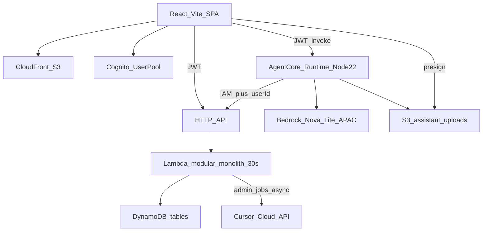
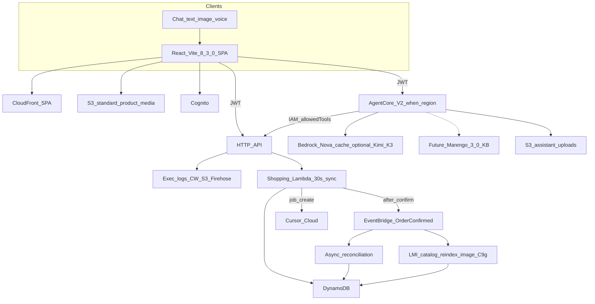

# SmartShop — Innovative features and architecture brief

**Date:** 2026-09-23  
**Audience:** Tech Evangelist / architecture review  
**Branch reviewed:** `Latest-Tech-Reviews`  
**Scope:** Recommendations only. Sample snippets below are illustrative. This file does not change `web/`, `services/`, `packages/`, or `infra/` runtime code.

Scout windows incorporated: **Frontend Scout**, **App Layer Scout**, **AI Backend Scout** (9–23 Sep 2026). Facts, version numbers, and links below follow the **authoritative scout digests** (23 Sep), not earlier paraphrases.

### Scout sources (authoritative)

| Scout | Fact | Source |
| --- | --- | --- |
| App Layer | API Gateway execution logs up to 1 MB → CloudWatch / S3 / Firehose (2026-09-09) | [Customize Amazon API Gateway destinations for execution logs](https://aws.amazon.com/blogs/compute/customize-amazon-api-gateway-destinations-for-execution-logs/) |
| App Layer | API Gateway BYO ACM client cert for backend mTLS (2026-09-08) | [Amazon API Gateway mutual TLS for backend](https://aws.amazon.com/about-aws/whats-new/2026/09/amazon-api-gateway-mutual-tls-backend/) |
| App Layer | Lambda Managed Instances 90-minute **async** timeout (2026-09-09); sync still 15 min; sync API Gateway → Lambda still 15 min | [AWS Lambda 90-minute function](https://aws.amazon.com/about-aws/whats-new/2026/09/aws-lambda-90-minute-function/) |
| App Layer | LMI Graviton5 C9g / C9gd / M9g / M9gd ~25% vs G4 (2026-09-09) | [AWS Lambda Graviton5 on EC2](https://aws.amazon.com/about-aws/whats-new/2026/09/aws-lambda-graviton5-ec2/) |
| App Layer | Node **v24.21.0 LTS Krypton** (2026-09-08) for prod/CI; v26.10.0 Current (2026-09-22) | Node release line (no new upstream security advisory in-window) |
| Frontend | Vite **CVE-2026-39364** active exploitation (F5 11 Sep; CSA AL-2026-124 17 Sep). Affected 7.1.0–7.3.1 and 8.0.0–8.0.4. Patch ≥7.3.2 / ≥8.0.5; ideally **8.3.0** (10 Sep) | Frontend Scout digest |
| Frontend | Chrome 154 (22 Sep); TypeScript stay on **7.0.2** (7.1 beta ~6 Oct); S3 Express One Zone in `ap-southeast-1` (~17 Sep) only for latency-sensitive **non-CDN** caches | Frontend Scout digest |
| AI Backend | AgentCore Runtime V2 GA 18 Sep (`platformVersion: V2`); elastic memory; ~1.9–2.0s P75 cold start; regions `us-east-1`, `us-east-2`, `us-west-2`, `eu-west-1`, `ap-northeast-1` | AI Backend Scout digest |
| AI Backend | AgentCore Harness research (Unit 42 / CSA 18–19 Sep, **not** an AWS CVE): harden `allowedTools` (drop shell/file), least-privilege vault, short-lived tokens, egress allowlist | AI Backend Scout digest |
| AI Backend | Kimi K3 on Bedrock GA 18 Sep; TwelveLabs Marengo 3.0 in Managed KB (11 Sep); Confluence DC connector + KB ACL debug APIs (9 Sep) | AI Backend Scout digest |

---

## 1. Executive summary

SmartShop’s MVP already matches the intended shape: Cognito email/password, a React + Vite SPA on S3/CloudFront, an API Gateway HTTP API in front of one Node TypeScript Lambda (Hono modular monolith), multi-table DynamoDB, Phase 5 Bedrock AgentCore assistant (text / image; tools over IAM), and Phase 7 Cursor cloud dashboard builder. Checkout is simulated and **idempotent**. Region is `ap-southeast-1`.

The highest-value work in this scout window is **not** a rewrite. It is:

1. **Patch the Vite 6.x dev surface** (Frontend Scout, **CVE-2026-39364**, F5 11 Sep / CSA AL-2026-124 17 Sep). `web/` is on `vite@^6.0.3` (outside the listed 7.1.0–7.3.1 / 8.0.0–8.0.4 ranges, but still unpatched and on the same class of exposed-dev-server risk). `vite.config.ts` binds port `5173` with no `server.fs.deny` and no explicit localhost-only host. Block public `:5173` / `--host`. **Rotate AWS keys** if a preview was ever exposed.
2. **Keep production and CI on Node v24.21.0 LTS Krypton** (App Layer Scout, 2026-09-08), not Current **v26.10.0** (2026-09-22). Lambda and AgentCore are Node 22 today; root `engines` is `>=20` and `.nvmrc` is `20`. No new upstream Node security advisory in-window — this is a pin policy, not an emergency CVE.
3. **Leave the 30 s shopping Lambda on the sync API Gateway path.** App Layer Scout: LMI 90-minute timeout is **async only**; sync functions and **sync API Gateway → Lambda remain 15 minutes**. Use LMI for **catalog reindex, image pipelines, and order reconciliation** — **not** sync checkout. Phase 7 dashboard generate already returns immediately via the Cursor Cloud HTTP API.
4. **Treat AgentCore Runtime V2 as a staged opt-in.** V2 GA (18 Sep) uses `platformVersion: V2`, elastic memory, ~1.9–2.0s P75 cold start, in `us-east-1` / `us-east-2` / `us-west-2` / `eu-west-1` / `ap-northeast-1` only. SmartShop Runtime is in **`ap-southeast-1`**. Keep Nova Lite on the APAC inference profile; evaluate Kimi K3 (`global.moonshotai.kimi-k3` / `us.moonshotai.kimi-k3`) and Marengo 3.0 as later model / RAG options.
5. **Add execution logs and post-order async work** instead of longer sync handlers. HTTP API has no execution-log destination today. App Layer Scout (2026-09-09): destination can be CloudWatch, S3, or Firehose, up to 1 MB — **migrate alarms off the auto-managed log group before enabling**, and keep `dataTraceEnabled` **off / scrubbed** in prod (PII / PCI). Backend **mTLS is N/A** unless a partner or payment backend requires a corporate CA (SmartShop has neither).

Net: harden the local frontend, pin LTS Krypton, opt into V2 when the region exists, cache prompts on the existing Converse loop, and run catalog / image / reconciliation jobs async (LMI if they outgrow 15 minutes) instead of stretching checkout.

---

## 2. Current architecture snapshot

Accurate to this repo (docs + code), not to marketing slides.

| Layer | What is in the repo today |
| --- | --- |
| Region / IaC | `ap-southeast-1`, AWS CDK (`infra/lib/smartshop-stack.ts`) |
| Auth | Cognito User Pool, email username, public SPA client, group `admin` |
| Web | React 18 + Vite 6 + TypeScript 5.7, Amplify Auth, routes for catalogue / cart / checkout / orders / chat / `/admin/reports` |
| Hosting | Private S3 + CloudFront; SPA `index.html` 403/404 fallback; `config.json` written at deploy |
| API | HTTP API: public `GET /v1/health` and `GET /v1/products*`; IAM `POST /v1/internal/assistant/tools`; JWT `/{proxy+}` |
| Backend | One `NodejsFunction` `smartshop-api`: Node 22, ARM64, 512 MB, **30 s**, Hono modules `identity` / `catalog` / `cart` / `pricing` / `orders` / `assistant` / `admin` |
| Data | DynamoDB tables: Products, Users, Carts, Orders (+ GSIs), OrderNumbers, Conversations, ReportJobs |
| Checkout | `POST /v1/orders` with `confirm: true` and optional `Idempotency-Key` (24 h replay) in `services/api/src/orders/` |
| Assistant | `services/assistant` on AgentCore Runtime (`NODE_22`, entry `server.js`). Converse + `apac.amazon.nova-lite-v1:0`. Tools SigV4 to the internal route. `userId` from JWT `sub` via `Authorization` allowlist. Zod `assistantToolNameSchema` (10 tools). Confirm guard in Runtime **and** Lambda |
| Uploads | Dedicated S3 bucket, 1-day lifecycle, JWT presign `POST /v1/assistant/uploads` |
| Phase 7 | Admin JWT jobs: create / poll / refine / approve. Cursor Cloud `POST https://api.cursor.com/v1/agents`. Writes confined to `web/src/admin/reports/generated/`. Key is server-side only |
| Observability | Lambda `logJson` (tokens stripped); alarms `smartshop-api-lambda-errors` and `smartshop-api-5xx` (Lambda / HTTP API **metrics**, not execution-log subscriptions). **No** API Gateway execution-log destination. Alarms do not currently depend on an auto-managed API Gateway log group — migrate any future subscription **before** flipping execution logs on |
| Images | Seed `imageUrl` values are **Unsplash** URLs (`scripts/seed.ts`), rendered raw in `ProductCard` / `HomePage` / `ProductPage` |
| Local Node | `.nvmrc` = `20`; root `engines.node` = `>=20`; esbuild bundle `target: "node20"` |
| CI | `.github/workflows/security.yml` — `npm audit` on PRs to `main`, Node 22. No Playwright / Puppeteer / Chromium pin |



Phase 5 and Phase 7 are **additive** and frozen against shopping contracts (`docs/project-technical-requirements.md` §2.4–2.5). That constraint is the design box for everything below.

---

## 3. Scout-aligned opportunity map

### Frontend Scout

| Theme | Maps cleanly? | Why |
| --- | --- | --- |
| **CVE-2026-39364** active exploitation (F5 11 Sep; CSA AL-2026-124 17 Sep). Affected **7.1.0–7.3.1** and **8.0.0–8.0.4**. Patch ≥7.3.2 / ≥8.0.5; ideally **8.3.0** (10 Sep). Block public `:5173` / `--host`; rotate **AWS keys** if preview was exposed | **Yes — P0** | `web/package.json` has `"vite": "^6.0.3"`. Dev script is `vite` on `:5173`. No `server.host` lock, no `fs.deny`. Semver `^6` must not float into an unpatched 7.x/8.x. Never `--host` this app |
| TypeScript stay on **7.0.2**; 7.1 beta ~6 Oct | **Not yet** | Repo is TypeScript **5.7.2**. Do not jump to 7.1 beta. When you move, land on 7.0.2 and stop |
| Chrome 154 (22 Sep) — bump Playwright / Puppeteer / Chromium in CI | **Later** | No browser E2E workflow today. When Playwright or Puppeteer lands, pin Chromium 154+ |
| S3 Express One Zone in `ap-southeast-1` (~17 Sep) — **only if latency-sensitive non-CDN caches** | **Mostly no** | Catalogue images are Unsplash, not an origin cache. DynamoDB is the product store. Do not put SPA assets or CloudFront-backed media on Express One Zone. Revisit only for a hot, non-CDN working set (e.g. assistant-upload transcode scratch) |

### App Layer Scout

| Theme | Maps cleanly? | Why |
| --- | --- | --- |
| API Gateway execution logs up to 1 MB → CW / S3 / Firehose (2026-09-09). Migrate alarms off the auto-managed log group **before** enabling. Keep `dataTraceEnabled` off / scrubbed in prod (PII / PCI) | **Yes** | HTTP API has no execution-log destination. Phase 6 redacts tokens in Lambda JSON. Gateway logs would catch authorizer / 409 stock / idempotency mismatches. Today’s alarms are metric-based (`ApiFn` errors, HTTP API 5xx) — still migrate any new log-group subscription **before** the flip. [Blog](https://aws.amazon.com/blogs/compute/customize-amazon-api-gateway-destinations-for-execution-logs/) |
| BYO ACM client cert for backend mTLS (2026-09-08). **Only if** partner / payment backends need a corporate CA | **N/A** | No partner or payment backends. Checkout is simulated. Assistant → API is SigV4 IAM. [What’s new](https://aws.amazon.com/about-aws/whats-new/2026/09/amazon-api-gateway-mutual-tls-backend/) |
| Lambda Managed Instances 90-min **async** timeout (2026-09-09). Sync still 15 min. Sync API Gateway → Lambda still 15 min. Use for **catalog reindex / image pipelines / order reconciliation** via async — **not** sync checkout | **Yes, as new async workers** | Shopping `ApiFn` is 30 s on the HTTP API (sync) and must stay that way. [What’s new](https://aws.amazon.com/about-aws/whats-new/2026/09/aws-lambda-90-minute-function/) |
| LMI Graviton5 C9g / C9gd / M9g / M9gd ~25% vs G4 (2026-09-09) | **Later, with LMI workers** | `ApiFn` is already ARM64 (`lambda.Architecture.ARM_64`) but is **not** LMI. Pick C9g/M9g when you add an async worker; C9gd/M9gd only if that worker needs instance-store (image pipeline). [What’s new](https://aws.amazon.com/about-aws/whats-new/2026/09/aws-lambda-graviton5-ec2/) |
| Node **v26.10.0 Current** (2026-09-22); prefer **v24.21.0 LTS Krypton** (2026-09-08) for prod/CI. No new upstream Node security advisory in-window | **Yes as a pin policy** | Tighten workspace `engines` / CI to `24.21.0`. Keep Lambda / AgentCore on AWS-supported Node 22 until a 24.x runtime is a deliberate CDK change |

### AI Backend Scout

| Theme | Maps cleanly? | Why |
| --- | --- | --- |
| AgentCore Runtime V2 GA 18 Sep: `platformVersion: V2`; elastic memory; ~1.9–2.0s P75 cold start. Regions: `us-east-1`, `us-east-2`, `us-west-2`, `eu-west-1`, `ap-northeast-1` | **Staged** | CDK already creates `agentcore.Runtime` (`smartshop_assistant`). V2 regions **do not include `ap-southeast-1`**. Opt in when Singapore ships V2, or spike a second Runtime in `ap-northeast-1` only if you accept cross-region JWT/tool latency |
| AgentCore Harness security research (Unit 42 / CSA 18–19 Sep, **not** an AWS CVE): harden `allowedTools` (drop shell/file), least-privilege vault, short-lived tokens, egress allowlist | **Yes — tighten what you already do** | `agent.ts` already ships an explicit `TOOL_CONFIG` and rejects unknown names. There is no shell/filesystem tool. Still pin `allowedTools`, keep Runtime credentials out of a broad vault, short-lived tokens, egress allowlist |
| Kimi K3 on Bedrock GA 18 Sep: ~2.8T, vision, 1M context, prompt caching. Profiles: `global.moonshotai.kimi-k3`, `us.moonshotai.kimi-k3` | **Optional model swap** | Current model is **Nova Lite APAC** because Singapore has no on-demand `amazon.nova-lite-v1:0`. Kimi profiles are `global` / `us` — confirm APAC routing before changing `BEDROCK_MODEL_ID`. Prompt caching applies to the existing Converse loop regardless |
| TwelveLabs Marengo 3.0 multimodal embeddings in Managed KB (11 Sep); Confluence DC connector + KB ACL debug APIs (9 Sep) | **Future RAG** | Catalogue is a 12-SKU `Scan` + `nameLower` filter. No manuals, no Confluence. Build a KB when you have first-party image/PDF assets; ACL debug APIs matter only if you later attach Confluence DC |

---

## 4. Recommended innovative features

### 4.1 Vite 8.3.0 pin and localhost-only dev server (P0)

**Why it fits SmartShop.** `npm run dev` is the documented Phase 4 loop (`http://localhost:5173`, `/v1` proxied to the deployed API). Frontend Scout: **CVE-2026-39364** is under **active exploitation** (F5 11 Sep; CSA AL-2026-124 17 Sep). Affected releases are **7.1.0–7.3.1** and **8.0.0–8.0.4**. Patch **≥7.3.2 / ≥8.0.5**; ideally **8.3.0** (10 Sep). Block public `:5173` / `--host`. If a preview was exposed, **rotate AWS keys** (and the Cognito app client / `.env` API URL as belt-and-suspenders).

**Where it lives:** `web/vite.config.ts`, `web/package.json` (pin only). No CloudFront change.

**Sample (illustrative — do not apply in this commit):**

```ts
// web/vite.config.ts — localhost only; never vite --host
import { defineConfig, loadEnv } from "vite";
import react from "@vitejs/plugin-react";

export default defineConfig(({ mode }) => {
  const env = loadEnv(mode, process.cwd(), "");
  return {
    plugins: [react()],
    server: {
      host: "127.0.0.1",
      port: 5173,
      strictPort: true,
      fs: {
        strict: true,
        deny: [".env", ".env.*", "**/.git/**", "**/node_modules/**"],
      },
      proxy: {
        "/v1": { target: env.VITE_API_URL, changeOrigin: true },
      },
    },
    preview: { host: "127.0.0.1", port: 4173 },
  };
});
```

```json
{ "devDependencies": { "vite": "8.3.0" } }
```

**Risks / sequencing.** Vite 6 → 8 is a major; run `npm run build -w @smartshop/web` and the existing `web` unit tests before deploy. Do not land on 8.0.0–8.0.4 (in the CVE range). Do not combine with a TypeScript 7 upgrade. After any exposed preview: rotate **AWS keys** first.

---

### 4.2 API Gateway 1 MB execution logs → CloudWatch / S3 / Firehose

**Why it fits SmartShop.** Cart/quote/order bugs are already the hard ones: `CART_EMPTY`, `INSUFFICIENT_STOCK`, `IDEMPOTENCY_CONFLICT`, assistant confirm-guard 4xx. Lambda `logJson` records `route` / `status` / `userId` but **not** API Gateway authorizer decisions or the up-to-1 MB execution payload. App Layer Scout (2026-09-09): destinations are CloudWatch, S3, or Firehose — see [customize execution-log destinations](https://aws.amazon.com/blogs/compute/customize-amazon-api-gateway-destinations-for-execution-logs/).

**Where it lives:** `infra` HTTP API / stage execution-log settings. Keep Lambda redaction.

**Sample (illustrative):**

```ts
// infra — App Layer Scout 2026-09-09
// 1. Create YOUR log group / S3 prefix / Firehose first.
// 2. Point alarms at that resource (do not leave them on the auto-managed group).
// 3. Then enable execution logs. dataTraceEnabled stays false in prod (PII/PCI).

const apiExecLogs = new logs.LogGroup(this, "ApiExecutionLogs", {
  logGroupName: "/smartshop/apigw/execution",
  retention: logs.RetentionDays.TWO_WEEKS,
  removalPolicy: RemovalPolicy.DESTROY,
});

// migrate any metric-filter / subscription alarms HERE, before the stage flip

const cfnStage = httpApi.defaultStage?.node.defaultChild as apigwv2.CfnStage | undefined;
cfnStage?.addPropertyOverride("AccessLogSettings", {
  DestinationArn: apiExecLogs.logGroupArn, // or S3 / Firehose ARN
  Format: JSON.stringify({
    requestId: "$context.requestId",
    routeKey: "$context.routeKey",
    status: "$context.status",
    latency: "$context.integrationLatency",
    authorizerError: "$context.authorizer.error",
    // never Authorization, Idempotency-Key, or $context.identity
  }),
});
// dataTraceEnabled: false  — do not log full payloads in prod
```

**Risks / sequencing.** **Migrate alarms off the auto-managed log group before enabling.** Keep `dataTraceEnabled` off (or fully scrubbed) in prod — this stack handles emails, JWTs, and order totals. Confirm HTTP API vs REST stage fields before synth. 14-day retention matches `ApiFnLogs`.

---

### 4.3 AgentCore Runtime V2 + Harness hardening (Unit 42 / CSA)

**Why it fits SmartShop.** Phase 5 already hosts the model loop on AgentCore (`services/assistant/src/server.ts` + `agent.ts`), not on the shopping Lambda. V2 GA (18 Sep): `platformVersion: V2`, elastic memory, ~1.9–2.0s P75 cold start — helps `/chat` first-token time. Same change is the moment to lock tools against AgentCore Harness research (Unit 42 / CSA 18–19 Sep, **not** an AWS CVE): harden `allowedTools` (drop shell/file), least-privilege vault, short-lived tokens, egress allowlist.

**Where it lives:** `infra` Runtime props; `services/assistant` tool config (already explicit). **Region gate:** do not set `platformVersion: V2` in `ap-southeast-1` until AWS lists that region (`us-east-1`, `us-east-2`, `us-west-2`, `eu-west-1`, `ap-northeast-1` only today).

**Sample (illustrative):**

```ts
// infra — opt-in only when the stack region supports V2
const V2_REGIONS = new Set([
  "us-east-1",
  "us-east-2",
  "us-west-2",
  "eu-west-1",
  "ap-northeast-1",
]);

const assistantRuntime = new agentcore.Runtime(this, "AssistantRuntime", {
  runtimeName: "smartshop_assistant",
  // platformVersion: V2_REGIONS.has(this.region) ? "V2" : undefined,
  agentRuntimeArtifact: agentcore.AgentRuntimeArtifact.fromCodeAsset({
    path: path.join(repoRoot, "services/assistant"),
    runtime: agentcore.AgentCoreRuntime.NODE_22,
    entrypoint: ["server.js"],
  }),
  environmentVariables: {
    SMARTSHOP_API_URL: httpApi.apiEndpoint,
    BEDROCK_MODEL_ID: "apac.amazon.nova-lite-v1:0",
    ALLOWED_TOOLS:
      "search_products,get_product,get_cart,upsert_cart_item,remove_cart_item,set_delivery,get_quote,confirm_order,list_orders,get_order",
  },
  networkConfiguration: {
    // egress allowlist: execute-api + bedrock + assistant-uploads bucket only
  },
});
```

```ts
// services/assistant — fail closed (mirrors packages/shared assistantToolNameSchema)
const ALLOWED = new Set(assistantToolNameSchema.options);

function assertAllowedTool(name: string): AssistantToolName {
  const parsed = assistantToolNameSchema.safeParse(name);
  if (!parsed.success || !ALLOWED.has(parsed.data)) {
    throw new Error("UNKNOWN_TOOL");
  }
  return parsed.data;
}

// Harness: never register shell, file, or vault-wide tools.
// Runtime role is the least-privilege vault: execute-api on ONE path,
// bedrock InvokeModel*, read assistant-uploads. No CURSOR_* , no /v1/admin/*.
```

**Risks / sequencing.** V2 is opt-in; a bad `platformVersion` in Singapore fails deploy. Do not add shell, `exec`, or filesystem tools “for debugging.” Confirm guard and `stripForgedUserId` stay. Tokens on the Runtime inbound path are Cognito JWTs (already short-lived: 1 h id/access in CDK).

---

### 4.4 Prompt caching + image-to-product (Nova now; Kimi K3 later)

**Why it fits SmartShop.** The system prompt and ten-tool schema are **identical every turn** (`SYSTEM` + `TOOL_CONFIG` in `agent.ts`). Kimi K3 on Bedrock GA 18 Sep (~2.8T, vision, 1M context, **prompt caching**; profiles `global.moonshotai.kimi-k3`, `us.moonshotai.kimi-k3`) is an optional later swap. Image attach already loads JPEG bytes from the uploads bucket into the user message — that is the seed of “photo → SKU” without a new public API.

**Where it lives:** `services/assistant` Converse call. Keep `BEDROCK_MODEL_ID` on the APAC Nova Lite profile until Kimi is confirmed for APAC invoke.

**Sample (illustrative):**

```ts
const response = await bedrock.send(
  new ConverseCommand({
    modelId: process.env.BEDROCK_MODEL_ID ?? "apac.amazon.nova-lite-v1:0",
    system: [
      {
        text: SYSTEM,
        // cachePoint: { type: "default" }, // when the chosen model supports prompt caching
      },
    ],
    messages,
    toolConfig: TOOL_CONFIG,
  }),
);

// Optional later (AI Backend Scout — Kimi K3 GA 18 Sep):
// BEDROCK_MODEL_ID=global.moonshotai.kimi-k3
// or us.moonshotai.kimi-k3
// Only after confirming APAC invoke + pricing + that confirm-guard tests still pass.
```

```ts
// Future tool — still IAM to existing catalog, no new authorizer
// search_products_by_image({ objectKey }) → catalog.filter on embedding or vision labels
// userId never in args; stripForgedUserId stays
```

**Risks / sequencing.** Do not switch models in the same change as V2. Voice (Nova Sonic) is a different path — leave it. Kimi 1M context is unnecessary for a 12-product Scan catalogue. Cache the system + tool spec, not customer PII turns, if the cache is shared.

---

### 4.5 Async catalog reindex, image pipeline, and order reconciliation (LMI 90 min — not checkout)

**Why it fits SmartShop.** `confirmOrder` already does reprice, stock decrement, cart clear, and 24 h idempotency. Stretching that path for email, image derivatives, or “rebuild search” would break the 30 s / p95 &lt; 500 ms NFR. App Layer Scout (2026-09-09): LMI 90-minute timeout is for **async** work — [90-minute function](https://aws.amazon.com/about-aws/whats-new/2026/09/aws-lambda-90-minute-function/). Sync API Gateway → Lambda is still **15 minutes**. Use LMI for **catalog reindex, image pipelines, and order reconciliation**. Emit `OrderConfirmed` after commit; consumers run async. Idempotent checkout already exists — do not invent a longer sync Lambda.

**Where it lives:** `services/api` orders module (publish only); EventBridge + **separate** async functions. Optional LMI + Graviton5 **C9g / M9g** (~25% vs G4; [Graviton5 on EC2](https://aws.amazon.com/about-aws/whats-new/2026/09/aws-lambda-graviton5-ec2/)) when a job can exceed 15 minutes. Do not change the `POST /v1/orders` JSON contract.

**Sample (illustrative):**

```ts
// after confirmOrder() succeeds — same Idempotency-Key still returns the same order
import { EventBridgeClient, PutEventsCommand } from "@aws-sdk/client-eventbridge";

await eventBridge.send(
  new PutEventsCommand({
    Entries: [
      {
        EventBusName: "smartshop",
        Source: "smartshop.orders",
        DetailType: "OrderConfirmed",
        Detail: JSON.stringify({
          userId: order.userId,
          orderId: order.orderId,
          orderNumber: order.orderNumber,
          totalCents: order.breakdown.totalCents,
        }),
      },
    ],
  }),
);
```

```ts
// Async workers — NOT attached to the HTTP API checkout route
// - order reconciliation: 30–60 s ordinary Lambda is enough at MVP volume
// - catalog reindex / image pipeline: LMI, timeout up to 90 min, architecture ARM_64
//   instance families C9g | C9gd | M9g | M9gd (~25% vs G4). Use *d only if you need instance store.

export async function onOrderConfirmed(event: EventBridgeEvent<"OrderConfirmed", OrderDetail>) {
  // receipt, reconciliation projection — never re-decrement stock
}

export async function reindexCatalog() {
  // Scan Products → search projection. Invoke async (EventBridge / SQS), not POST /v1/products
}
```

**Risks / sequencing.** Publish **after** the DynamoDB transaction commits. Consumers must be idempotent on `orderId`. Do not let the assistant `confirm_order` tool wait on enrichment. Do not put these workers behind the JWT `/{proxy+}` route. LMI is optional until a job actually exceeds 15 minutes.

---

### 4.6 First-party product images (CloudFront variants; Express One Zone only for non-CDN scratch)

**Why it fits SmartShop.** Home, category, and PDP all render `product.imageUrl` at full Unsplash size. Moving originals to S3 behind CloudFront gives WebP/AVIF and width variants. Frontend Scout is explicit: S3 Express One Zone in `ap-southeast-1` (~17 Sep) is **only** for latency-sensitive **non-CDN** caches — not the SPA bucket and not a CDN image origin.

**Where it lives:** `scripts/seed.ts` + admin product `imageUrl`; CloudFront behavior; `web` `` (srcset). Image **pipeline** (resize/transcode) is the App Layer LMI job in §4.5. Not the shopping Lambda.

**Sample (illustrative):**

```tsx
// web/src/ProductCard.tsx — after originals live on a media prefix (standard S3 + CloudFront)
const media = `/media/${product.productId}`;


```

**Risks / sequencing.** **Do this after** you stop hot-linking Unsplash (or after you copy bytes into S3). Do not put Express One Zone in front of CloudFront. A 12-SKU catalogue does not need Express. Do not put transforms on `/index.html` or `/config.json`.

---

### 4.7 Phase 7 long jobs: keep Cursor Cloud async; LMI is for pipelines, not `wait()` on checkout

**Why it fits SmartShop.** Technical requirements already say: shopping Lambda stays 30 s; report jobs are async; the request thread must not `wait()` on generate. `cursor-cloud.ts` already `POST`s `/v1/agents` and stores `agentId` + `runId`. App Layer Scout LMI 90-minute async timeout is sized for **catalog reindex / image pipelines / order reconciliation**, not for holding an HTTP request. Phase 7 should stay “start agent, return job id.”

**Where it lives:** `services/api/src/admin/reports/` (keep HTTP short). Secrets stay off the browser.

**Sample (illustrative):**

```ts
// keep this shape — HTTP returns immediately
const started = await startDashboardAgent(body.prompt);
const job = await createRunningJob({
  createdBy: claims.sub,
  prompt: body.prompt,
  agentId: started.agentId,
  runId: started.runId,
});
return c.json(job, 201);

// Do not attach an LMI 90-min function to POST /v1/admin/reports/jobs
// If you ever self-host wait(), it is still a background worker — not ApiFn
```

**Risks / sequencing.** Dual-using AgentCore for dashboards is a documented **must-not**. Path allowlist (`web/src/admin/reports/generated/`) stays. No `cdk deploy` credentials on the agent. Node **v26.10.0 Current** is irrelevant here — workers use LTS Krypton or the AWS Node 22 runtime.

---

### 4.8 Node v24.21.0 LTS Krypton pin vs v26.10.0 Current

**Why it fits SmartShop.** Three Node stories exist at once: `.nvmrc` 20, Lambda/AgentCore **22**, App Layer Scout **v24.21.0 LTS Krypton** (2026-09-08) for prod/CI, and Current **v26.10.0** (2026-09-22). Experimental Current APIs have no place next to money and JWTs. No new upstream Node security advisory in-window.

**Where it lives:** root `package.json` `engines`, `.nvmrc`, CI `node-version` (today `22` in `.github/workflows/security.yml`), later CDK `runtime` / `bundling.target`.

**Sample (illustrative):**

```json
{
  "engines": {
    "node": "24.21.0"
  }
}
```

```text
# .nvmrc — v24.21.0 LTS Krypton for laptops/CI; Lambda stays NODEJS_22_X until a planned bump
24.21.0
```

**Risks / sequencing.** Bumping workspace `engines` without bumping Lambda `NODEJS_22_X` is fine. Do not set Lambda or AgentCore to Current 26.10.0. Do not wait on TypeScript 7.1 beta (~6 Oct); when TS moves, stay on **7.0.2**.

---

## 5. Suggested target architecture



ASCII equivalent:

```
[SPA Vite 8.3.0 / CF]--+--[HTTP API + 1MB exec logs]--[Shopping Lambda 30s sync]--[DynamoDB]
         |                      |                            |
         |                      +-- CW/S3/Firehose           +-- EventBridge
         +-- Cognito                                         +-- async recon / LMI reindex+images (C9g)
         +-- AgentCore (platformVersion V2 when region)
         +-- Bedrock (Nova cache; optional global.moonshotai.kimi-k3)
         +-- S3 standard media (Express One Zone only for non-CDN scratch)
```

---

## 6. Prioritized backlog

### P0 — security (do first)

| Item | Scout | Action |
| --- | --- | --- |
| Pin Vite **8.3.0** (or ≥7.3.2 / ≥8.0.5). Do not land in 7.1.0–7.3.1 or 8.0.0–8.0.4. Lock `server.host` to `127.0.0.1` | Frontend (CVE-2026-39364; F5; CSA AL-2026-124) | Patch `web/`; never `--host` / public `:5173`; **rotate AWS keys** if preview was exposed |
| Keep secrets off the Vite process | Frontend | `.env` deny list; no `CURSOR_*` in `config.json` (already true) |
| Prod/CI on **v24.21.0 LTS Krypton**; do not adopt **v26.10.0 Current** on Lambda, AgentCore, or CI | App Layer | Stay on Node 22 in AWS until a planned runtime bump |
| Reaffirm `allowedTools` (no shell/file), least-privilege vault, short-lived tokens, egress allowlist | AI Backend (Unit 42 / CSA; not an AWS CVE) | Already in Zod + `TOOL_CONFIG`; add Runtime egress allowlist when you touch CDK |

### P1 — customer value

| Item | Scout | Action |
| --- | --- | --- |
| Prompt cache on the existing Converse system + tools | AI Backend | `services/assistant` only; keep Nova Lite APAC |
| Image → product on the current upload path | AI Backend | Same 10-tool contract; optional extra tool later |
| `OrderConfirmed` EventBridge + async reconciliation | App Layer | Do not extend `confirmOrder`; LMI only if a job exceeds 15 min |
| API Gateway 1 MB execution logs → CW / S3 / Firehose | App Layer | Migrate alarms off auto-managed group first; `dataTraceEnabled` off in prod |
| AgentCore V2 when `ap-southeast-1` (or a documented dual-region) exists | AI Backend | Opt-in `platformVersion: V2` |

### P2 — platform

| Item | Scout | Action |
| --- | --- | --- |
| First-party product images on standard S3 + CloudFront | — | After seed/admin `imageUrl` points at S3 |
| S3 Express One Zone (`ap-southeast-1`) | Frontend | **Only** latency-sensitive non-CDN caches |
| Workspace `engines` / `.nvmrc` / CI → **24.21.0 LTS Krypton** | App Layer | Separate from Lambda `NODEJS_22_X` |
| Chrome 154+ Playwright / Puppeteer / Chromium when E2E CI exists | Frontend | No browser CI today |
| TypeScript **7.0.2** (not 7.1 beta ~6 Oct) | Frontend | After Vite 8.3.0 is stable |
| Async catalog reindex / image pipeline on LMI Graviton5 C9g/M9g (~25% vs G4) | App Layer | Not on `ApiFn` |
| Marengo 3.0 Managed KB (+ Confluence DC / ACL debug only if you attach Confluence) | AI Backend | After you have documents to embed |
| Kimi K3 A/B (`global.moonshotai.kimi-k3` / `us.moonshotai.kimi-k3`) | AI Backend | After APAC routing + confirm-guard tests |

---

## 7. Explicit non-goals

- **Do not rewrite the modular monolith** into microservices, or move Converse onto `smartshop-api`.
- **Do not raise the shopping Lambda timeout** or attach LMI to `ApiFn` / sync checkout / quotes. Sync API Gateway → Lambda remains 15 minutes; checkout stays 30 s.
- **Do not** dual-authorize existing cart/quote/order routes (JWT **or** IAM). Internal tools stay the explicit IAM route.
- **Do not** add API Gateway backend **mTLS** unless a partner or payment backend requires a corporate CA. SmartShop has neither today. ([What’s new](https://aws.amazon.com/about-aws/whats-new/2026/09/amazon-api-gateway-mutual-tls-backend/))
- **Do not** expose the Vite dev server (`--host`, `0.0.0.0`, public `:5173`).
- **Do not** run production, CI, Lambda, or AgentCore on Node **v26.10.0 Current**, or wait on TypeScript 7.1 beta.
- **Do not** put `CURSOR_DASHBOARD_API_KEY` in the SPA, `config.json`, or generated dashboard source.
- **Do not** teach the dashboard agent shopping tools, or teach the shopping assistant admin/metrics tools.
- **Do not** deploy AgentCore Gateway MCP or JWT-passthrough tools in this window (already deferred in §2.1).
- **Do not** set `platformVersion: V2` in `ap-southeast-1` until that region is on the V2 list.
- **Do not** put SPA or CloudFront media on S3 Express One Zone.
- **Do not** replace DynamoDB product keys with S3 Express, or invent a second pricing engine.
- **Do not** enable API Gateway execution logs with `dataTraceEnabled` on in prod, and do not leave alarms on the auto-managed log group.
- **Do not** log raw JWTs, passwords, or `Idempotency-Key` material in gateway or Firehose logs.

---

## How to try next

1. **Vite (CVE-2026-39364):** In a throwaway branch, pin `vite@8.3.0` (not 8.0.0–8.0.4), set `server.host: "127.0.0.1"`, run `npm run build -w @smartshop/web` and `npm run test -w @smartshop/web`. Confirm `npm run dev` still proxies `/v1`. If `:5173` was ever public, rotate **AWS keys**.
2. **Execution logs:** Create a dedicated log group or S3 prefix first; point any new alarms at it; then enable 1 MB execution logs with `dataTraceEnabled: false`. Place a test order with a colliding `Idempotency-Key` and find the 409 without opening a JWT. [Destinations blog](https://aws.amazon.com/blogs/compute/customize-amazon-api-gateway-destinations-for-execution-logs/).
3. **Assistant cache:** Add a Converse `cachePoint` on `SYSTEM` + `TOOL_CONFIG` against Nova Lite APAC; compare token spend on a 10-turn “mug → cart → quote” script (`services/assistant` tests already cover confirm-guard).
4. **V2 probe:** If `ap-southeast-1` is still absent from the V2 region list, stop. If Tokyo (`ap-northeast-1`) is acceptable for a spike, deploy a **second** Runtime with `platformVersion: V2` and measure cold start (~1.9–2.0s P75) — do not cut the Singapore Runtime over.
5. **Async jobs:** After a local `confirmOrder` fixture, `PutEvents` with `orderId` and write a no-op reconciliation consumer. Prove a double submit (same idempotency key) emits **one** logical enrichment. Size catalog reindex / image pipeline as async (LMI C9g only if &gt; 15 min).
6. **Images:** Copy one Unsplash seed into **standard** S3, point that SKU’s `imageUrl` at `/media/...`. Do not use Express One Zone for that origin.
7. **Engines:** Pin workspace / CI to **v24.21.0 LTS Krypton**; leave `Runtime.NODEJS_22_X` and AgentCore `NODE_22` untouched. Ignore v26.10.0 Current.

---

*Brief only. No application or infrastructure code was changed to produce this document. Scout names, versions, and links follow the 23 Sep authoritative digests.*
