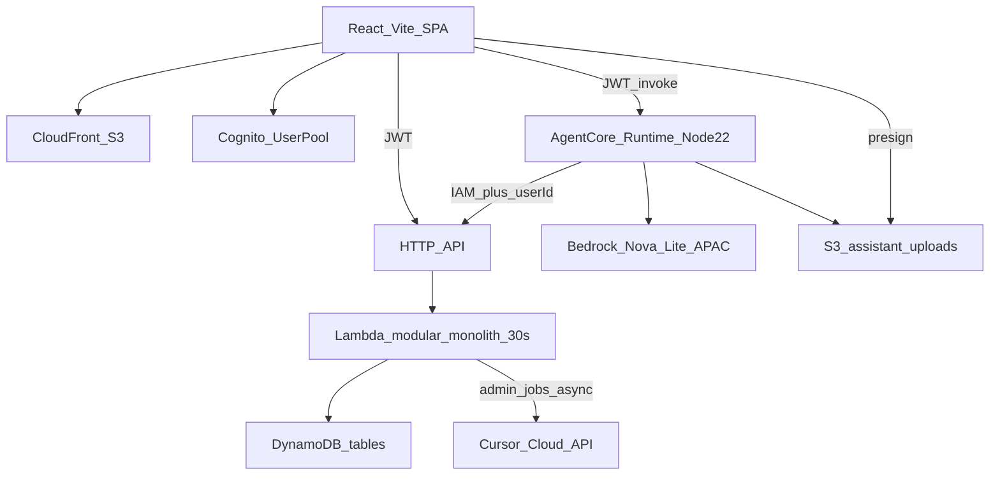
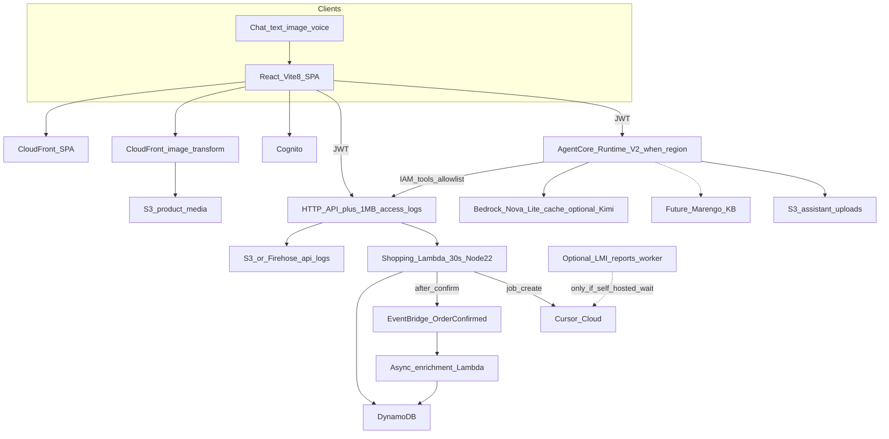

# SmartShop — Innovative features and architecture brief

**Date:** 2026-09-23  
**Audience:** Tech Evangelist / architecture review  
**Branch reviewed:** `Latest-Tech-Reviews`  
**Scope:** Recommendations only. Sample snippets below are illustrative. This file does not change `web/`, `services/`, `packages/`, or `infra/` runtime code.

Scout windows incorporated: **Frontend Scout**, **App Layer Scout**, **AI Backend Scout** (9–23 Sep 2026).

---

## 1. Executive summary

SmartShop’s MVP already matches the intended shape: Cognito email/password, a React + Vite SPA on S3/CloudFront, an API Gateway HTTP API in front of one Node TypeScript Lambda (Hono modular monolith), multi-table DynamoDB, Phase 5 Bedrock AgentCore assistant (text / image; tools over IAM), and Phase 7 Cursor cloud dashboard builder. Checkout is simulated and **idempotent**. Region is `ap-southeast-1`.

The highest-value work in this scout window is **not** a rewrite. It is:

1. **Patch the Vite 6.x dev surface** (Frontend Scout CVE-2026-39364). `web/` is on `vite@^6.0.3`; `vite.config.ts` binds port `5173` with no `server.fs.deny` and no explicit localhost-only host.
2. **Keep production on LTS Node**, not Current 26.x. Lambda and AgentCore are already Node 22; root `engines` is `>=20` and `.nvmrc` is `20`. Pin **24.x LTS** for laptops/CI when you are ready; do not adopt 26.9/26.10 experimental APIs in prod.
3. **Leave the 30 s shopping Lambda alone.** App Layer Scout’s Lambda Managed Instances (LMI) 90-minute async timeout is useful only for a **separate** Phase 7 worker — and today dashboard generate already returns immediately via the Cursor Cloud HTTP API. Sync API Gateway → Lambda is still 15 minutes max; checkout does not need any of that headroom.
4. **Treat AgentCore Runtime V2 as a staged opt-in**, not a drop-in. V2 GA (18 Sep) is in `us-east-1`, `us-east-2`, `us-west-2`, `eu-west-1`, `ap-northeast-1`. SmartShop Runtime is deployed in **`ap-southeast-1`**. Keep Nova Lite on the APAC inference profile; evaluate Kimi K3 / Marengo as later model and RAG options, not Phase 5 blockers.
5. **Add observability and post-order async work** instead of longer sync handlers. HTTP API has no access log destination today; Phase 6 only emits redacted Lambda JSON plus two CloudWatch alarms. API Gateway 1 MB execution-log delivery (9 Sep) maps cleanly to cart/order debug. Partner-style backend **mTLS is N/A** — there are no outbound partner APIs.

Net: harden the local frontend, pin runtimes, opt into V2 when the region exists, cache prompts on the existing Converse loop, and emit events after `confirmOrder` instead of stretching the monolith.

---

## 2. Current architecture snapshot

Accurate to this repo (docs + code), not to marketing slides.

| Layer | What is in the repo today |
| --- | --- |
| Region / IaC | `ap-southeast-1`, AWS CDK (`infra/lib/smartshop-stack.ts`) |
| Auth | Cognito User Pool, email username, public SPA client, group `admin` |
| Web | React 18 + Vite 6 + TypeScript 5.7, Amplify Auth, routes for catalogue / cart / checkout / orders / chat / `/admin/reports` |
| Hosting | Private S3 + CloudFront; SPA `index.html` 403/404 fallback; `config.json` written at deploy |
| API | HTTP API: public `GET /v1/health` and `GET /v1/products*`; IAM `POST /v1/internal/assistant/tools`; JWT `/{proxy+}` |
| Backend | One `NodejsFunction` `smartshop-api`: Node 22, ARM64, 512 MB, **30 s**, Hono modules `identity` / `catalog` / `cart` / `pricing` / `orders` / `assistant` / `admin` |
| Data | DynamoDB tables: Products, Users, Carts, Orders (+ GSIs), OrderNumbers, Conversations, ReportJobs |
| Checkout | `POST /v1/orders` with `confirm: true` and optional `Idempotency-Key` (24 h replay) in `services/api/src/orders/` |
| Assistant | `services/assistant` on AgentCore Runtime (`NODE_22`, entry `server.js`). Converse + `apac.amazon.nova-lite-v1:0`. Tools SigV4 to the internal route. `userId` from JWT `sub` via `Authorization` allowlist. Zod `assistantToolNameSchema` (10 tools). Confirm guard in Runtime **and** Lambda |
| Uploads | Dedicated S3 bucket, 1-day lifecycle, JWT presign `POST /v1/assistant/uploads` |
| Phase 7 | Admin JWT jobs: create / poll / refine / approve. Cursor Cloud `POST https://api.cursor.com/v1/agents`. Writes confined to `web/src/admin/reports/generated/`. Key is server-side only |
| Observability | Lambda `logJson` (tokens stripped); alarms `smartshop-api-lambda-errors` and `smartshop-api-5xx`. **No** HTTP API access log / Firehose |
| Images | Seed `imageUrl` values are **Unsplash** URLs (`scripts/seed.ts`), rendered raw in `ProductCard` / `HomePage` / `ProductPage` |
| Local Node | `.nvmrc` = `20`; root `engines.node` = `>=20`; esbuild bundle `target: "node20"` |
| CI | `.github/workflows/security.yml` — `npm audit` on PRs to `main`. No Playwright / Chrome channel pin |



Phase 5 and Phase 7 are **additive** and frozen against shopping contracts (`docs/project-technical-requirements.md` §2.4–2.5). That constraint is the design box for everything below.

---

## 3. Scout-aligned opportunity map

### Frontend Scout

| Theme | Maps cleanly? | Why |
| --- | --- | --- |
| Vite CVE-2026-39364 / `server.fs.deny` bypass; patch ≥7.3.2 / ≥8.0.5, ideally **8.3.0** (10 Sep) | **Yes — P0** | `web/package.json` has `"vite": "^6.0.3"`. Dev script is `vite` on `:5173`. No `server.host` lock, no `fs.deny`. Never `--host` this app |
| TypeScript stay on 7.0.2; 7.1 beta ~6 Oct | **Not yet** | Repo is TypeScript **5.7.2**. Do not jump to 7.1 beta. When you move, land on 7.0.2 and stop |
| Node 26.9.0 Current (16 Sep) experimental APIs | **No for prod** | Keep LTS. See App Layer Node pin |
| Chrome 154 (22 Sep) security fixes — bump CI browsers | **Later** | No browser E2E workflow today. When Playwright lands, pin Chromium 154+ |
| S3 Express One Zone expanded incl. Singapore (~17 Sep) | **Optional later** | Region match (`ap-southeast-1`). Catalogue images are not on S3 yet; DynamoDB is the product store. Useful if you ingest first-party image bytes, not for cart/order keys |
| CloudFront quiet; Dynamic Image Transformation just outside window | **After image origin exists** | Distribution is SPA-only (`CACHING_OPTIMIZED` + OAC). Unsplash URLs bypass CloudFront. DIT is valuable once originals live on S3 |

### App Layer Scout

| Theme | Maps cleanly? | Why |
| --- | --- | --- |
| API Gateway execution-log delivery up to 1 MB → CW / S3 / Firehose (9 Sep) | **Yes** | HTTP API construct has CORS and routes only — no access-log destination. Phase 6 already redacts tokens in Lambda logs; gateway logs would catch authorizer / 409 stock / idempotency mismatches |
| BYO ACM client cert for backend mTLS (8 Sep) | **N/A** | No partner or bank callbacks. Assistant → API is SigV4 IAM. Do not add mTLS |
| Lambda Managed Instances: 90 min async/ESM; Graviton5; sync still 15 min (9 Sep) | **Only a future Phase 7 worker** | Shopping `ApiFn` is 30 s and must stay that way. Phase 7 already starts a cloud agent and returns `{ jobId, agentId, status }`. Do **not** put LMI on checkout |
| Node v26.10.0 / 26.9.0 / 26.8.2 Current; **v24.21.0 LTS** for prod; no new upstream Node advisory in window | **Yes as a pin policy** | Tighten `engines` to `^24.21.0` (or `^22` until you bump Lambda). Keep AgentCore / Lambda on AWS-supported Node 22 until a 24.x runtime is a deliberate CDK change |

### AI Backend Scout

| Theme | Maps cleanly? | Why |
| --- | --- | --- |
| AgentCore Runtime V2 GA (18 Sep): elastic memory, ~1.9–2.0 s P75 cold start; opt-in `platformVersion` V2 | **Staged** | CDK already creates `agentcore.Runtime` (`smartshop_assistant`). V2 regions **do not include `ap-southeast-1`**. Opt in when Singapore ships V2, or run a second Runtime in `ap-northeast-1` only if you accept cross-region JWT/tool latency |
| Kimi K3 on Bedrock (18 Sep): ~2.8T, vision, 1M context, explicit prompt caching; `global.moonshotai.kimi-k3` / `us.moonshotai.kimi-k3` | **Optional model swap** | Current model is **Nova Lite APAC** because Singapore has no on-demand `amazon.nova-lite-v1:0`. Kimi profiles are global/us — confirm APAC routing before changing `BEDROCK_MODEL_ID`. Prompt caching applies to the existing Converse loop regardless |
| Managed KB: TwelveLabs Marengo 3.0 multimodal embeddings (11 Sep); Confluence DC + ACL debug | **Future RAG** | Catalogue is a 12-SKU `Scan` + `nameLower` filter. No manuals, no Confluence. Build a KB when you have first-party image/PDF assets |
| AgentCore Harness default shell/file tools + credential exfil (research, not AWS CVE) | **Yes — tighten what you already do** | `agent.ts` already ships an explicit `TOOL_CONFIG` and rejects unknown names. There is no shell/filesystem tool. Still pin `allowedTools`, least-privilege Runtime role, short-lived tokens, egress allowlist |

---

## 4. Recommended innovative features

### 4.1 Vite 8.3.0 pin and localhost-only dev server (P0)

**Why it fits SmartShop.** `npm run dev` is the documented Phase 4 loop (`http://localhost:5173`, `/v1` proxied to the deployed API). An exposed Vite dev server is an active-exploitation path (Frontend Scout). The SPA also loads Cognito client ids from `web/.env` / `config.json` — rotate those if `:5173` was ever bound to `0.0.0.0` or `--host`.

**Where it lives:** `web/vite.config.ts`, `web/package.json` (pin only). No CloudFront change.

**Sample (illustrative — do not apply in this commit):**

```ts
// web/vite.config.ts — localhost only; never vite --host
import { defineConfig, loadEnv } from "vite";
import react from "@vitejs/plugin-react";

export default defineConfig(({ mode }) => {
  const env = loadEnv(mode, process.cwd(), "");
  return {
    plugins: [react()],
    server: {
      host: "127.0.0.1",
      port: 5173,
      strictPort: true,
      fs: {
        strict: true,
        deny: [".env", ".env.*", "**/.git/**", "**/node_modules/**"],
      },
      proxy: {
        "/v1": { target: env.VITE_API_URL, changeOrigin: true },
      },
    },
    preview: { host: "127.0.0.1", port: 4173 },
  };
});
```

```json
{ "devDependencies": { "vite": "8.3.0" } }
```

**Risks / sequencing.** Vite 6 → 8 is a major; run `npm run build -w @smartshop/web` and the existing `web` unit tests before deploy. Do not combine with a TypeScript 7 upgrade. If a laptop ever advertised `--host`, rotate the Cognito app client and any `.env` API URLs.

---

### 4.2 HTTP API 1 MB execution logs to S3 (and optional Firehose)

**Why it fits SmartShop.** Cart/quote/order bugs are already the hard ones: `CART_EMPTY`, `INSUFFICIENT_STOCK`, `IDEMPOTENCY_CONFLICT`, assistant confirm-guard 4xx. Lambda `logJson` records `route` / `status` / `userId` but **not** API Gateway authorizer decisions or the raw 1 MB execution payload. App Layer Scout’s configurable delivery (9 Sep) is the missing Phase 6 slice.

**Where it lives:** `infra` HTTP API stage access logs. Keep Lambda redaction. Do not log `Authorization` or `Idempotency-Key` values in custom access-log format.

**Sample (illustrative):**

```ts
// infra — HTTP API access logs (App Layer Scout, 9 Sep 2026)
import * as logs from "aws-cdk-lib/aws-logs";
import * as s3 from "aws-cdk-lib/aws-s3";

const apiAccessBucket = new s3.Bucket(this, "ApiAccessLogs", {
  blockPublicAccess: s3.BlockPublicAccess.BLOCK_ALL,
  encryption: s3.BucketEncryption.S3_MANAGED,
  enforceSSL: true,
  lifecycleRules: [{ expiration: Duration.days(14) }],
});

const defaultStage = httpApi.defaultStage?.node.defaultChild as apigwv2.CfnStage | undefined;
defaultStage?.addPropertyOverride("AccessLogSettings", {
  DestinationArn: apiAccessBucket.bucketArn, // or CloudWatch / Firehose ARN
  Format: JSON.stringify({
    requestId: "$context.requestId",
    routeKey: "$context.routeKey",
    status: "$context.status",
    latency: "$context.integrationLatency",
    authorizer: "$context.authorizer.error",
    // never $context.identity or raw Authorization
  }),
});
```

**Risks / sequencing.** Confirm the 9 Sep delivery target you want (CW vs S3 vs Firehose) for **HTTP API** (this stack is HTTP API, not REST). PII: `userId` is already in Lambda logs — do not also dump JWT claims at the gateway. 14-day lifecycle matches `ApiFnLogs`.

---

### 4.3 AgentCore Runtime V2 + harness hardening

**Why it fits SmartShop.** Phase 5 already hosts the model loop on AgentCore (`services/assistant/src/server.ts` + `agent.ts`), not on the shopping Lambda. V2’s elastic memory and ~2 s P75 cold starts (AI Backend Scout, 18 Sep) help `/chat` first-token time. The same change is the moment to lock tools and egress against the AgentCore Harness research (default shell/file tools + credential exfil).

**Where it lives:** `infra` Runtime props; `services/assistant` tool config (already explicit). **Region gate:** do not set `platformVersion: "V2"` in `ap-southeast-1` until AWS lists that region.

**Sample (illustrative):**

```ts
// infra — opt-in only when the stack region supports V2
const V2_REGIONS = new Set([
  "us-east-1",
  "us-east-2",
  "us-west-2",
  "eu-west-1",
  "ap-northeast-1",
]);

const assistantRuntime = new agentcore.Runtime(this, "AssistantRuntime", {
  runtimeName: "smartshop_assistant",
  // platformVersion: V2_REGIONS.has(this.region) ? "V2" : undefined,
  agentRuntimeArtifact: agentcore.AgentRuntimeArtifact.fromCodeAsset({
    path: path.join(repoRoot, "services/assistant"),
    runtime: agentcore.AgentCoreRuntime.NODE_22,
    entrypoint: ["server.js"],
  }),
  environmentVariables: {
    SMARTSHOP_API_URL: httpApi.apiEndpoint,
    BEDROCK_MODEL_ID: "apac.amazon.nova-lite-v1:0",
    ALLOWED_TOOLS: "search_products,get_product,get_cart,upsert_cart_item,remove_cart_item,set_delivery,get_quote,confirm_order,list_orders,get_order",
  },
  networkConfiguration: {
    // egress allowlist: execute-api + bedrock + assistant-uploads bucket only
  },
});
```

```ts
// services/assistant — fail closed (mirrors packages/shared assistantToolNameSchema)
const ALLOWED = new Set(assistantToolNameSchema.options);

function assertAllowedTool(name: string): AssistantToolName {
  const parsed = assistantToolNameSchema.safeParse(name);
  if (!parsed.success || !ALLOWED.has(parsed.data)) {
    throw new Error("UNKNOWN_TOOL");
  }
  return parsed.data;
}
```

**Risks / sequencing.** V2 is opt-in; a bad `platformVersion` in Singapore fails deploy. Do not add shell, `exec`, or filesystem tools “for debugging.” Runtime role already has `execute-api:Invoke` on one path, `bedrock:InvokeModel*`, and read on uploads — do not broaden to `/v1/admin/*` or `CURSOR_*` secrets. Confirm guard and `stripForgedUserId` stay.

---

### 4.4 Prompt caching + image-to-product (Nova now; Kimi K3 later)

**Why it fits SmartShop.** The system prompt and ten-tool schema are **identical every turn** (`SYSTEM` + `TOOL_CONFIG` in `agent.ts`). Bedrock prompt caching (and Kimi’s explicit cache, 18 Sep) cuts repeat Converse cost. Image attach already loads JPEG bytes from the uploads bucket into the user message — that is the seed of “photo → SKU” without a new public API.

**Where it lives:** `services/assistant` Converse call. Keep `BEDROCK_MODEL_ID` on the APAC Nova Lite profile until Kimi is confirmed in-region. Optional later: a `search_products_by_image` tool that still hits `catalog` — never a second catalogue.

**Sample (illustrative):**

```ts
const response = await bedrock.send(
  new ConverseCommand({
    modelId: process.env.BEDROCK_MODEL_ID ?? "apac.amazon.nova-lite-v1:0",
    system: [
      {
        text: SYSTEM,
        // cachePoint: { type: "default" }, // when the chosen model supports it
      },
    ],
    messages,
    toolConfig: TOOL_CONFIG,
  }),
);

// Optional later (AI Backend Scout — Kimi K3 profiles):
// BEDROCK_MODEL_ID=global.moonshotai.kimi-k3
// Only after confirming APAC invoke + pricing + that confirm-guard tests still pass.
```

```ts
// Future tool — still IAM to existing catalog, no new authorizer
// search_products_by_image({ objectKey }) → catalog.filter on embedding or vision labels
// userId never in args; stripForgedUserId stays
```

**Risks / sequencing.** Do not switch models in the same PR as V2. Voice (Nova Sonic) is a different path — leave it. Kimi 1M context is unnecessary for a 12-product Scan catalogue. Cache the system + tool spec, not customer PII turns, if the cache is shared.

---

### 4.5 Event-driven post-order enrichment (not a longer checkout Lambda)

**Why it fits SmartShop.** `confirmOrder` already does reprice, stock decrement, cart clear, and 24 h idempotency. Stretching that path for email, “you might also like,” or analytics would break the 30 s / p95 &lt; 500 ms NFR. App Layer Scout’s 90-minute LMI is the wrong tool for **sync** checkout (API GW → Lambda remains 15 minutes even on LMI). Emit an event after a successful confirm; consumers run async.

**Where it lives:** `services/api` orders module (publish only); new EventBridge rule + small consumer Lambda (or SQS). Do not change the `POST /v1/orders` JSON contract.

**Sample (illustrative):**

```ts
// after confirmOrder() succeeds — same Idempotency-Key still returns the same order
import { EventBridgeClient, PutEventsCommand } from "@aws-sdk/client-eventbridge";

await eventBridge.send(
  new PutEventsCommand({
    Entries: [
      {
        EventBusName: "smartshop",
        Source: "smartshop.orders",
        DetailType: "OrderConfirmed",
        Detail: JSON.stringify({
          userId: order.userId,
          orderId: order.orderId,
          orderNumber: order.orderNumber,
          totalCents: order.breakdown.totalCents,
        }),
      },
    ],
  }),
);
```

```ts
// consumer (separate function, 30–60 s is enough; LMI 90 min is still overkill)
export async function onOrderConfirmed(event: EventBridgeEvent<"OrderConfirmed", OrderDetail>) {
  // receipt email, metrics materialize, "customers also bought" — never re-decrement stock
}
```

**Risks / sequencing.** Publish **after** the DynamoDB transaction commits. Consumers must be idempotent on `orderId` (the web already is). Do not let the assistant `confirm_order` tool wait on enrichment. This is the alternative to “just raise the shopping Lambda timeout.”

---

### 4.6 CloudFront Dynamic Image Transformation for product images

**Why it fits SmartShop.** Home, category, and PDP all render `product.imageUrl` at full Unsplash size. Frontend Scout’s CloudFront Dynamic Image Transformation (just outside the window, still the right AWS feature) gives WebP/AVIF, width variants, and a single origin once images are first-party.

**Where it lives:** `scripts/seed.ts` + admin product `imageUrl`; CloudFront behavior or image-transform distribution; `web` `` (srcset). Not the shopping Lambda.

**Sample (illustrative):**

```tsx
// web/src/ProductCard.tsx — after originals live on the SPA bucket or a media prefix
const media = `/media/${product.productId}`;


```

**Risks / sequencing.** **Do this after** you stop hot-linking Unsplash (or after you copy bytes into S3). DIT on third-party URLs is the wrong design. S3 Express One Zone in Singapore is optional for high-QPS media; a 12-SKU catalogue does not need it. Do not put transforms on `/index.html` or `/config.json`.

---

### 4.7 Phase 7 long jobs: keep Cursor Cloud async; LMI only if you self-host `wait()`

**Why it fits SmartShop.** Technical requirements already say: shopping Lambda stays 30 s; report jobs are async; the request thread must not `wait()` on generate. `cursor-cloud.ts` already `POST`s `/v1/agents` and stores `agentId` + `runId`. App Layer Scout LMI 90-minute async/ESM + Graviton5 is for a **dedicated worker** if you ever pull `run.wait()` in-process — not for `ApiFn`, not for checkout.

**Where it lives:** `services/api/src/admin/reports/` (keep HTTP short); optional new `services/reports-worker` + LMI later. Secrets stay off the browser.

**Sample (illustrative):**

```ts
// keep this shape — HTTP returns immediately
const started = await startDashboardAgent(body.prompt);
const job = await createRunningJob({
  createdBy: claims.sub,
  prompt: body.prompt,
  agentId: started.agentId,
  runId: started.runId,
});
return c.json(job, 201);

// later, only if Cursor wait() moves in-process:
// new NodejsFunction ReportsWorker: timeout Duration.minutes(90), *not* attached to HTTP API
// reserved concurrent / LMI; ARM64 Graviton; no cart/order IAM
```

**Risks / sequencing.** Dual-using AgentCore for dashboards is a documented **must-not**. Path allowlist (`web/src/admin/reports/generated/`) stays. No `cdk deploy` credentials on the agent. Node 26 Current is irrelevant here.

---

### 4.8 Node LTS pin (24.x) vs Current — engines and Lambda stay conservative

**Why it fits SmartShop.** Three Node stories exist at once: `.nvmrc` 20, Lambda/AgentCore **22**, App Layer Scout **24.21.0 LTS** for prod, and Current **26.10.0** (22 Sep). Frontend Scout also says keep LTS. Experimental 26.x APIs have no place next to money and JWTs.

**Where it lives:** root `package.json` `engines`, `.nvmrc`, CI `node-version`, later CDK `runtime` / `bundling.target`. Not a feature flag.

**Sample (illustrative):**

```json
{
  "engines": {
    "node": "^24.21.0"
  }
}
```

```text
# .nvmrc — match engines once laptops move; until then stay on 22 to match Lambda
22
```

**Risks / sequencing.** Bumping `engines` without bumping Lambda `NODEJS_22_X` is fine (24 is for the workspace). Do not set Lambda to a Current 26 runtime. No new Node security advisory in-window — this is hygiene, not an emergency patch.

---

## 5. Suggested target architecture



ASCII equivalent:

```
[SPA Vite 8 / CF]--+--[HTTP API + access logs]--[Shopping Lambda 30s]--[DynamoDB]
       |                    |                         |
       |                    +-- S3/Firehose           +-- EventBridge --> enrichment
       +-- Cognito                                    +-- Cursor Cloud (Phase 7 jobs)
       +-- AgentCore (V2 when region) -- Bedrock (cached Nova; Kimi later)
       +-- Image CF -- S3 media (after leaving Unsplash)
```

---

## 6. Prioritized backlog

### P0 — security (do first)

| Item | Scout | Action |
| --- | --- | --- |
| Pin Vite ≥8.3.0 (or ≥7.3.2 minimum) and lock `server.host` to `127.0.0.1` | Frontend | Patch `web/`; never `--host` / public `:5173`; rotate Cognito client if exposed |
| Keep secrets off the Vite process | Frontend | `.env` deny list; no `CURSOR_*` in `config.json` (already true) |
| Do not adopt Node 26 Current on Lambda, AgentCore, or CI | Frontend + App Layer | Stay on 22 in AWS; plan 24.21.0 LTS for workspace |
| Reaffirm assistant tool allowlist + no harness shell/file tools | AI Backend | Already in Zod + `TOOL_CONFIG`; add Runtime egress allowlist when you touch CDK |

### P1 — customer value

| Item | Scout | Action |
| --- | --- | --- |
| Prompt cache on the existing Converse system + tools | AI Backend | `services/assistant` only; keep Nova Lite APAC |
| Image → product on the current upload path | AI Backend | Same 10-tool contract; optional extra tool later |
| Post-order EventBridge enrichment | App Layer | Receipt / “also bought”; do not extend `confirmOrder` |
| HTTP API 1 MB logs to S3 for cart/order 409s | App Layer | Infra-only; redact tokens |
| AgentCore V2 when `ap-southeast-1` (or a documented dual-region) exists | AI Backend | Opt-in `platformVersion` V2 |

### P2 — platform

| Item | Scout | Action |
| --- | --- | --- |
| First-party product images + CloudFront DIT | Frontend | After seed/admin `imageUrl` points at S3 |
| S3 Express One Zone (Singapore) for media | Frontend | Only if image QPS justifies it |
| Node `engines` / `.nvmrc` → 24.21.0 LTS | App Layer | Separate from Lambda 22 |
| Chrome 154+ when Playwright CI exists | Frontend | No browser CI today |
| TypeScript 7.0.2 (not 7.1 beta) | Frontend | After Vite 8 is stable |
| Marengo 3.0 managed KB for manuals / SKU photos | AI Backend | After you have documents to embed |
| LMI 90 min reports worker | App Layer | Only if `wait()` leaves Cursor Cloud |
| Kimi K3 model A/B | AI Backend | After APAC routing + confirm-guard tests |

---

## 7. Explicit non-goals

- **Do not rewrite the modular monolith** into microservices, or move Converse onto `smartshop-api`.
- **Do not raise the shopping Lambda timeout** or attach LMI to `ApiFn` / checkout / quotes.
- **Do not** dual-authorize existing cart/quote/order routes (JWT **or** IAM). Internal tools stay the explicit IAM route.
- **Do not** add API Gateway backend **mTLS** — there is no partner API to call.
- **Do not** expose the Vite dev server (`--host`, `0.0.0.0`, public `:5173`).
- **Do not** run production or Lambda on Node Current 26.x, or wait on TypeScript 7.1 beta.
- **Do not** put `CURSOR_DASHBOARD_API_KEY` in the SPA, `config.json`, or generated dashboard source.
- **Do not** teach the dashboard agent shopping tools, or teach the shopping assistant admin/metrics tools.
- **Do not** deploy AgentCore Gateway MCP or JWT-passthrough tools in this window (already deferred in §2.1).
- **Do not** set `platformVersion: V2` in `ap-southeast-1` until that region is on the V2 list.
- **Do not** replace DynamoDB product keys with S3 Express, or invent a second pricing engine.
- **Do not** log raw JWTs, passwords, or `Idempotency-Key` material in gateway or Firehose logs.

---

## How to try next

1. **Vite:** In a throwaway branch, pin `vite@8.3.0`, set `server.host: "127.0.0.1"`, run `npm run build -w @smartshop/web` and `npm run test -w @smartshop/web`. Confirm `npm run dev` still proxies `/v1`.
2. **Logs:** Synth a CDK diff that only adds HTTP API access logs to a 14-day S3 prefix; place a test order with a colliding `Idempotency-Key` and find the 409 without opening a JWT.
3. **Assistant cache:** Add a Converse `cachePoint` on `SYSTEM` + `TOOL_CONFIG` against Nova Lite APAC; compare token spend on a 10-turn “mug → cart → quote” script (`services/assistant` tests already cover confirm-guard).
4. **V2 probe:** Read the current AgentCore V2 region list. If Singapore is absent, stop. If Tokyo is acceptable for a spike, deploy a **second** Runtime with `platformVersion: "V2"` and measure cold start — do not cut the Singapore Runtime over.
5. **Post-order event:** After a local `confirmOrder` fixture, `PutEvents` with `orderId` and write a no-op consumer that logs `orderNumber` only. Prove a double submit (same idempotency key) emits **one** logical enrichment.
6. **Images:** Copy one Unsplash seed into the web bucket, point that SKU’s `imageUrl` at `/media/...`, and only then attach a transform query string.
7. **Engines:** Decide `22` vs `24.21.0` for `.nvmrc` in a docs/CI PR; leave `Runtime.NODEJS_22_X` and AgentCore `NODE_22` untouched.

---

*Brief only. No application or infrastructure code was changed to produce this document.*
