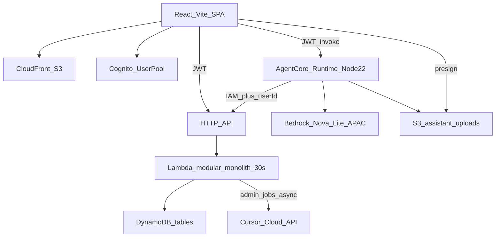
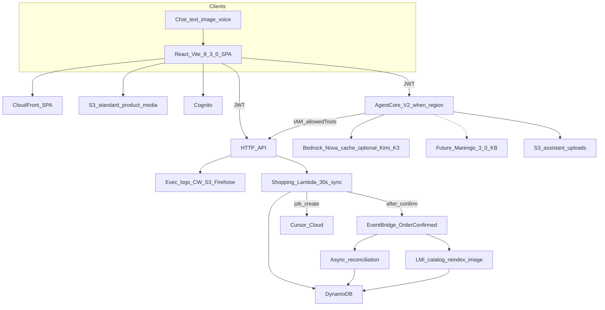

# SmartShop — Innovative features and architecture brief

**Date:** 2026-09-24  
**Audience:** Tech Evangelist / architecture review  
**Branch reviewed:** `Latest-Tech-Reviews`  
**Scope:** Recommendations only. Sample snippets below are illustrative. This file does not change `web/`, `services/`, `packages/`, or `infra/` runtime code.

Scout windows incorporated: **AI Backend Scout**, **Frontend Scout**, **App Layer Scout** (~10–24 Sep 2026). Facts, version numbers, and links below follow the **authoritative 24 Sep scout digests**, not earlier paraphrases. The 23 Sep brief (`docs/2026-09-23-innovative-features-and-architecture.md`) remains on this branch as the prior snapshot.

### Scout sources (authoritative)

| Scout | Fact | Source |
| --- | --- | --- |
| Frontend | Vite **CVE-2026-39364** under active exploitation (F5 ~11 Sep; CSA AL-2026-124 on 17 Sep). Unauthenticated `server.fs.deny` bypass on exposed Vite dev/preview. Affected **7.1.0–7.3.1**, **8.0.0–8.0.4** (`vite-plus` **≤0.1.15**). Patch **≥7.3.2 / ≥8.0.5** (ideally **8.3.0**). Never expose `--host` / `:5173`; rotate keys if preview was reachable | [CSA AL-2026-124](https://www.csa.gov.sg/alerts-and-advisories/alerts/al-2026-124/); [F5 Labs](https://www.f5.com/labs/articles/cloud-takeover-mass-scanning-for-exposed-vite-endpoints-cve-2026-39364); [GHSA-v2wj-q39q-566r](https://github.com/vitejs/vite/security/advisories/GHSA-v2wj-q39q-566r) |
| Frontend | Vite **8.3.0** (10 Sep) — `root` tsconfig option and other 8.3 notes | [vite v8.3.0 CHANGELOG](https://github.com/vitejs/vite/blob/v8.3.0/packages/vite/CHANGELOG.md) |
| Frontend | Chrome **154** Stable (22 Sep) — 108 security fixes; bump Playwright / Puppeteer / Chromium in CI | [Chrome 154 release notes](https://developer.chrome.com/release-notes/154) |
| Frontend | TypeScript stay on **7.0.2**; 7.1 beta ~6 Oct | Frontend Scout digest |
| Frontend | Firefox **156** (15 Sep) — `Promise.try()`; scrollbar `@supports` change | Frontend Scout digest |
| Frontend | S3 Express One Zone expanded to `ap-southeast-1` (Singapore) ~17 Sep — latency-sensitive **non-CDN** caches only, not typical S3+CloudFront static hosting | [S3 Express Regions and Zones](https://docs.aws.amazon.com/AmazonS3/latest/userguide/s3-express-Regions-and-Zones.html) |
| App Layer | API Gateway execution logs up to **1 MB** + configurable destinations (Compute Blog 9 Sep) — CloudWatch / S3 / Firehose; migrate alarms off the auto-managed group first; `dataTraceEnabled` = PII risk for checkout | [Customize Amazon API Gateway destinations for execution logs](https://aws.amazon.com/blogs/compute/customize-amazon-api-gateway-destinations-for-execution-logs/) |
| App Layer | API Gateway BYO client cert for backend mTLS (8 Sep) — partners / payment only | [Amazon API Gateway mutual TLS for backend](https://aws.amazon.com/about-aws/whats-new/2026/09/amazon-api-gateway-mutual-tls-backend/) |
| App Layer | Lambda Managed Instances 90-minute timeout **async only**; sync + API Gateway → Lambda still **15** minutes | [AWS Lambda 90-minute function](https://aws.amazon.com/about-aws/whats-new/2026/09/aws-lambda-90-minute-function/) |
| App Layer | Graviton5 on LMI ~25% vs G4 | [AWS Lambda Graviton5 on EC2](https://aws.amazon.com/about-aws/whats-new/2026/09/aws-lambda-graviton5-ec2/) |
| App Layer | Node **v24.21.0 LTS Krypton** (9 Sep) — pin for API / Lambda / CI. **v26.10.0 Current** (22 Sep) and **v26.9.0** (16 Sep) are tooling only. **v22.23.3 LTS** (23 Sep) only if still on 22; prefer 24 LTS | [Node v24.21.0](https://nodejs.org/en/blog/release/v24.21.0) |
| AI Backend | AgentCore Harness defaults (research 18–19 Sep, **not** an AWS CVE) — `shell` + `file_operations` on by default; prompt injection → root shell → vault JWT exfil. Set `allowedTools` per session; drop shell/file unless required; least-privilege vault + short-lived tokens + egress allowlisting | [CSA research note — AgentCore credential exfiltration](https://labs.cloudsecurityalliance.org/research/csa-research-note-aws-agentcore-credential-exfiltration-2026/) |
| AI Backend | AgentCore Runtime **V2** GA (18 Sep) — elastic memory + ~1.9–2.0s P75 cold starts (vs 5.4–30s V1). Opt in: `platformVersion: V2`. Regions: `us-east-1` / `us-east-2` / `us-west-2` / `eu-west-1` / `ap-northeast-1` | [AgentCore Runtime generally available](https://aws.amazon.com/about-aws/whats-new/2026/09/new-agentcore-runtime-generally-available/) |
| AI Backend | Kimi K3 on Bedrock (18 Sep) — 1M context, prompt caching; profiles `global.moonshotai.kimi-k3` / `us.moonshotai.kimi-k3` | [Moonshot AI Kimi K3 on Amazon Bedrock](https://aws.amazon.com/about-aws/whats-new/2026/09/moonshot-ai-kimi-k3-on-amazon-bedrock/) |
| AI Backend | Marengo 3.0 multimodal KB embeddings (11 Sep) | [Bedrock Managed KB multimodal embeddings — TwelveLabs Marengo](https://aws.amazon.com/about-aws/whats-new/2026/09/amazon-bedrock-managed-knowledge-base-multimodal-embeddings-twelvelabs-marengo/) |
| AI Backend | AgentCore Evaluations: TypeScript frameworks — Strands, LangGraph, OpenAI Agents, Vercel AI SDK | [AgentCore release notes](https://docs.aws.amazon.com/bedrock-agentcore/latest/devguide/release-notes.html) |
| AI Backend | Consent Portal + harness lifecycle hooks (Sep) | AI Backend Scout digest |
| AI Backend | Out of window: **CVE-2026-18830** (Aug) patched server-side — no customer action | AI Backend Scout digest |

---

## 1. P0 — do these first

Five items from the 24 Sep scouts. Treat them as the working order before any “innovative” backlog.

### 1.1 Vite CVE-2026-39364 — patch and never expose `--host` / `:5173`

**Authoritative:** unauthenticated `server.fs.deny` bypass on **exposed** Vite dev/preview. Affected **7.1.0–7.3.1**, **8.0.0–8.0.4** (`vite-plus` **≤0.1.15**). Patch **≥7.3.2 / ≥8.0.5**; ideally **8.3.0** (10 Sep). Active exploitation: F5 ~11 Sep; CSA **AL-2026-124** on 17 Sep.

- [CSA AL-2026-124](https://www.csa.gov.sg/alerts-and-advisories/alerts/al-2026-124/)
- [F5 Labs — mass scanning for exposed Vite endpoints](https://www.f5.com/labs/articles/cloud-takeover-mass-scanning-for-exposed-vite-endpoints-cve-2026-39364)
- [GHSA-v2wj-q39q-566r](https://github.com/vitejs/vite/security/advisories/GHSA-v2wj-q39q-566r)
- [vite 8.3.0 CHANGELOG](https://github.com/vitejs/vite/blob/v8.3.0/packages/vite/CHANGELOG.md)

**SmartShop today.** `web/package.json` has `"vite": "^6.0.3"`. `web/vite.config.ts` binds port `5173` with a `/v1` proxy and **no** `server.host` lock, **no** `server.fs.deny`. Dev script is `vite`. Semver `^6` must not float into an unpatched 7.x/8.x. `vite-plus` is not a dependency — do not add it at ≤0.1.15.

**Guidance.** Pin **8.3.0** (or at least ≥8.0.5 / ≥7.3.2). Bind `server.host` and `preview.host` to `127.0.0.1`. Never `vite --host`, never `0.0.0.0`, never a public `:5173` / `:4173`. If a preview was reachable, **rotate AWS keys** (and the Cognito app client / `.env` API URL as belt-and-suspenders).

**Sample (illustrative — do not apply in this commit):**

```ts
// web/vite.config.ts — localhost only; never vite --host
import { defineConfig, loadEnv } from "vite";
import react from "@vitejs/plugin-react";

export default defineConfig(({ mode }) => {
  const env = loadEnv(mode, process.cwd(), "");
  return {
    plugins: [react()],
    server: {
      host: "127.0.0.1",
      port: 5173,
      strictPort: true,
      fs: {
        strict: true,
        deny: [".env", ".env.*", "**/.git/**", "**/node_modules/**"],
      },
      proxy: {
        "/v1": { target: env.VITE_API_URL, changeOrigin: true },
      },
    },
    preview: { host: "127.0.0.1", port: 4173 },
  };
});
```

```json
{ "devDependencies": { "vite": "8.3.0" } }
```

**What not to do.** Do not expose Vite `--host` / `:5173`. Do not land on 8.0.0–8.0.4 or 7.1.0–7.3.1. Do not add `vite-plus` ≤0.1.15. Do not combine the Vite major with a TypeScript 7 upgrade.

---

### 1.2 AgentCore Harness `allowedTools` lockdown (not an AWS CVE)

**Authoritative:** research 18–19 Sep (CSA / Unit 42 class finding, **not** an AWS CVE). Harness defaults enable `shell` + `file_operations`. Prompt injection → root shell → vault JWT exfil. Set `allowedTools` **per session**; drop shell/file unless required; least-privilege vault + short-lived tokens + egress allowlisting.

- [CSA research note — AWS AgentCore credential exfiltration](https://labs.cloudsecurityalliance.org/research/csa-research-note-aws-agentcore-credential-exfiltration-2026/)

Out of window (no action): **CVE-2026-18830** (Aug) is patched server-side.

**SmartShop today.** `services/assistant/src/agent.ts` already ships an explicit `TOOL_CONFIG` of the ten shopping tools (`search_products` … `get_order`) and rejects unknown names via `assistantToolNameSchema`. There is no `shell` / `file_operations` tool. Runtime inbound JWTs are already short-lived (1 h id/access in CDK). Runtime role is scoped to `execute-api` on the internal tools path, Bedrock, and the uploads bucket.

**Guidance.** Treat the CSA note as a **lockdown checklist**, not a new AWS advisory. Pin `allowedTools` on every Runtime session. Never register `shell`, `file_operations`, or vault-wide tools “for debugging.” Keep the Runtime role as the least-privilege vault (no `CURSOR_*`, no `/v1/admin/*`). Add an egress allowlist (execute-api + Bedrock + assistant-uploads only) when you next touch CDK. Consent Portal + harness lifecycle hooks (Sep) are the place to refuse a session that tries to widen tools.

**Sample (illustrative — do not apply in this commit):**

```ts
// Session start — fail closed. Not an AWS CVE; still lock the defaults.
const SHOP_TOOLS = [
  "search_products",
  "get_product",
  "get_cart",
  "upsert_cart_item",
  "remove_cart_item",
  "set_delivery",
  "get_quote",
  "confirm_order",
  "list_orders",
  "get_order",
] as const;

const session = {
  allowedTools: [...SHOP_TOOLS],
  // never: "shell", "file_operations", "exec", "vault"
};

function assertAllowedTool(name: string): (typeof SHOP_TOOLS)[number] {
  const parsed = assistantToolNameSchema.safeParse(name);
  if (!parsed.success || !session.allowedTools.includes(parsed.data)) {
    throw new Error("UNKNOWN_TOOL");
  }
  return parsed.data;
}

// Runtime role = least-privilege vault:
//   execute-api POST /v1/internal/assistant/tools
//   bedrock InvokeModel*
//   s3:GetObject on assistant-uploads
// Short-lived tokens (Cognito 1 h). Egress allowlist only those three.
```

**What not to do.** Do not treat this as an AWS CVE hotfix. Do not add a debug shell. Do not put Runtime credentials in a broad vault. Do not let the model choose `userId`. Confirm guard and `stripForgedUserId` stay.

---

### 1.3 AgentCore Runtime V2 — staged opt-in

**Authoritative:** V2 GA 18 Sep. Elastic memory; ~**1.9–2.0s P75** cold starts (vs **5.4–30s** V1). Opt in with `platformVersion: V2`. Regions: `us-east-1`, `us-east-2`, `us-west-2`, `eu-west-1`, `ap-northeast-1`.

- [New AgentCore Runtime generally available](https://aws.amazon.com/about-aws/whats-new/2026/09/new-agentcore-runtime-generally-available/)

**SmartShop today.** CDK already creates `agentcore.Runtime` (`smartshop_assistant`) on **`NODE_22`** in **`ap-southeast-1`**. V2 regions **do not include Singapore**.

**Guidance.** Keep the Singapore Runtime on V1 until AWS lists `ap-southeast-1`. Do not set `platformVersion: V2` in this region — deploy fails. A Tokyo (`ap-northeast-1`) spike is acceptable only if you accept cross-region JWT/tool latency; do not cut the Singapore Runtime over. Pair the V2 opt-in (when the region exists) with the §1.2 `allowedTools` lockdown.

**Sample (illustrative — do not apply in this commit):**

```ts
// infra — opt-in only when the stack region supports V2
// https://aws.amazon.com/about-aws/whats-new/2026/09/new-agentcore-runtime-generally-available/
const V2_REGIONS = new Set([
  "us-east-1",
  "us-east-2",
  "us-west-2",
  "eu-west-1",
  "ap-northeast-1",
]);

const assistantRuntime = new agentcore.Runtime(this, "AssistantRuntime", {
  runtimeName: "smartshop_assistant",
  // platformVersion: V2_REGIONS.has(this.region) ? "V2" : undefined,
  agentRuntimeArtifact: agentcore.AgentRuntimeArtifact.fromCodeAsset({
    path: path.join(repoRoot, "services/assistant"),
    runtime: agentcore.AgentCoreRuntime.NODE_22, // pin Node 24.21.0 when NODE_24 ships
    entrypoint: ["server.js"],
  }),
  environmentVariables: {
    SMARTSHOP_API_URL: httpApi.apiEndpoint,
    BEDROCK_MODEL_ID: "apac.amazon.nova-lite-v1:0",
    ALLOWED_TOOLS:
      "search_products,get_product,get_cart,upsert_cart_item,remove_cart_item,set_delivery,get_quote,confirm_order,list_orders,get_order",
  },
});
```

**What not to do.** Do not set `platformVersion: V2` in `ap-southeast-1` today. Do not dual-use AgentCore for Phase 7 dashboards. Do not swap the Bedrock model in the same change as V2.

---

### 1.4 API Gateway 1 MB execution-log destinations + `dataTrace` / PII caution

**Authoritative:** Compute Blog 9 Sep. Execution logs up to **1 MB**; destinations CloudWatch / S3 / Firehose. **Migrate alarms off the auto-managed group first.** `dataTraceEnabled` is a **PII risk** for checkout.

- [Customize Amazon API Gateway destinations for execution logs](https://aws.amazon.com/blogs/compute/customize-amazon-api-gateway-destinations-for-execution-logs/)

**SmartShop today.** HTTP API has **no** execution-log destination. Lambda `logJson` redacts tokens. Alarms `smartshop-api-lambda-errors` and `smartshop-api-5xx` are **metric**-based (Lambda errors / HTTP API 5xx), not execution-log subscriptions. Cart / quote / order bugs (`CART_EMPTY`, `INSUFFICIENT_STOCK`, `IDEMPOTENCY_CONFLICT`, assistant confirm-guard 4xx) still benefit from authorizer + integration traces.

**Guidance.** Create **your** log group / S3 prefix / Firehose first. Point any new metric-filter or subscription alarm at that resource. Then enable execution logs. Keep `dataTraceEnabled` **false** in prod (or fully scrubbed). Never log `Authorization`, `Idempotency-Key`, passwords, or `$context.identity` wholesale. 14-day retention matches `ApiFnLogs`.

**Sample (illustrative — do not apply in this commit):**

```ts
// infra — App Layer Scout 2026-09-09
// 1. Create YOUR log group / S3 prefix / Firehose first.
// 2. Point alarms at that resource (do not leave them on the auto-managed group).
// 3. Then enable execution logs. dataTraceEnabled stays false in prod (PII/PCI).

const apiExecLogs = new logs.LogGroup(this, "ApiExecutionLogs", {
  logGroupName: "/smartshop/apigw/execution",
  retention: logs.RetentionDays.TWO_WEEKS,
  removalPolicy: RemovalPolicy.DESTROY,
});

// migrate any metric-filter / subscription alarms HERE, before the stage flip

const cfnStage = httpApi.defaultStage?.node.defaultChild as apigwv2.CfnStage | undefined;
cfnStage?.addPropertyOverride("AccessLogSettings", {
  DestinationArn: apiExecLogs.logGroupArn, // or S3 / Firehose ARN
  Format: JSON.stringify({
    requestId: "$context.requestId",
    routeKey: "$context.routeKey",
    status: "$context.status",
    latency: "$context.integrationLatency",
    authorizerError: "$context.authorizer.error",
    // never Authorization, Idempotency-Key, or $context.identity
  }),
});
// dataTraceEnabled: false  — do not log full payloads in prod checkout
```

**What not to do.** Do not enable `dataTraceEnabled` in prod checkout without scrubbing. Do not leave alarms on the auto-managed log group. Do not dump raw JWTs, emails, or order-line PII to Firehose.

---

### 1.5 Node **v24.21.0 LTS Krypton** pin across API / Lambda / frontend CI

**Authoritative:** **v24.21.0 LTS Krypton** (9 Sep) — pin for API / Lambda / CI. **v26.10.0 Current** (22 Sep) and **v26.9.0** (16 Sep) are **tooling only**. **v22.23.3 LTS** (23 Sep) only if you are still on 22; prefer 24 LTS. Frontend Scout: align frontend CI / Playwright to the same 24 LTS pin.

- [Node v24.21.0](https://nodejs.org/en/blog/release/v24.21.0)

**SmartShop today.** `.nvmrc` = `20`; root `engines.node` = `>=20`; Lambda `NODEJS_22_X` + esbuild `target: "node20"`; AgentCore `NODE_22`; `.github/workflows/security.yml` `node-version: 22`. Three (now four) Node stories at once.

**Guidance.** Pin **24.21.0** everywhere engineers and CI run the API, frontend, and tests. Plan the Lambda / AgentCore runtime bump to Node 24 in the same pin program (CDK `NODEJS_24_X` / `NODE_24` when those constants exist — do not invent a Current 26 runtime). If a surface must stay on 22 for one release, hold it on **v22.23.3 LTS** (23 Sep), not a random 22.x, and keep the written target as 24.21.0.

**Sample (illustrative — do not apply in this commit):**

```json
{
  "engines": {
    "node": "24.21.0"
  }
}
```

```text
# .nvmrc — v24.21.0 LTS Krypton for laptops / API / frontend CI
24.21.0
```

```yaml
# .github/workflows/security.yml — and any future Playwright job
- uses: actions/setup-node@v4
  with:
    node-version: 24.21.0
```

**What not to do.** Do not run production, CI, Lambda, or AgentCore on **v26.10.0** or **v26.9.0 Current**. Do not wait on TypeScript 7.1 beta (~6 Oct); when TS moves, stay on **7.0.2**. Do not leave `.nvmrc` on 20 while CI claims 24.

---

## 2. Executive summary

SmartShop’s MVP already matches the intended shape: Cognito email/password, a React + Vite SPA on S3/CloudFront, an API Gateway HTTP API in front of one Node TypeScript Lambda (Hono modular monolith), multi-table DynamoDB, Phase 5 Bedrock AgentCore assistant (text / image; tools over IAM), and Phase 7 Cursor cloud dashboard builder. Checkout is simulated and **idempotent**. Region is `ap-southeast-1`.

The highest-value work in this scout window is **not** a rewrite. It is the P0 list in §1:

1. Patch the Vite 6.x dev surface (**CVE-2026-39364**; F5 ~11 Sep / CSA AL-2026-124 17 Sep). Never `--host` / public `:5173`. Rotate keys if preview was reachable.
2. Lock AgentCore Harness `allowedTools` (research 18–19 Sep, **not** an AWS CVE). Drop `shell` / `file_operations`. Least-privilege vault, short-lived tokens, egress allowlist.
3. Treat AgentCore Runtime V2 as a **staged** opt-in (`platformVersion: V2`) — regions do not include `ap-southeast-1` yet.
4. Add HTTP API execution logs (up to 1 MB → CloudWatch / S3 / Firehose) **after** migrating alarms; keep `dataTraceEnabled` off / scrubbed in prod checkout.
5. Pin **Node v24.21.0 LTS Krypton** across API / Lambda / frontend CI. Current 26.x is tooling only.

Net: harden the local frontend, lock the harness, pin LTS Krypton, opt into V2 when the region exists, cache prompts on the existing Converse loop, and run catalog / image / reconciliation jobs **async** (LMI if they outgrow 15 minutes) instead of stretching checkout.

---

## 3. Current architecture snapshot

Accurate to this repo (docs + code), not to marketing slides.

| Layer | What is in the repo today |
| --- | --- |
| Region / IaC | `ap-southeast-1`, AWS CDK (`infra/lib/smartshop-stack.ts`) |
| Auth | Cognito User Pool, email username, public SPA client, group `admin` |
| Web | React 18 + Vite 6 + TypeScript 5.7, Amplify Auth, routes for catalogue / cart / checkout / orders / chat / `/admin/reports` |
| Hosting | Private S3 + CloudFront; SPA `index.html` 403/404 fallback; `config.json` written at deploy |
| API | HTTP API: public `GET /v1/health` and `GET /v1/products*`; IAM `POST /v1/internal/assistant/tools`; JWT `/{proxy+}` |
| Backend | One `NodejsFunction` `smartshop-api`: Node 22, ARM64, 512 MB, **30 s**, Hono modules `identity` / `catalog` / `cart` / `pricing` / `orders` / `assistant` / `admin` |
| Data | DynamoDB tables: Products, Users, Carts, Orders (+ GSIs), OrderNumbers, Conversations, ReportJobs |
| Checkout | `POST /v1/orders` with `confirm: true` and optional `Idempotency-Key` (24 h replay) in `services/api/src/orders/` |
| Assistant | `services/assistant` on AgentCore Runtime (`NODE_22`, entry `server.js`). Converse + `apac.amazon.nova-lite-v1:0`. Tools SigV4 to the internal route. `userId` from JWT `sub` via `Authorization` allowlist. Zod `assistantToolNameSchema` (10 tools). Confirm guard in Runtime **and** Lambda |
| Uploads | Dedicated S3 bucket, 1-day lifecycle, JWT presign `POST /v1/assistant/uploads` |
| Phase 7 | Admin JWT jobs: create / poll / refine / approve. Cursor Cloud `POST https://api.cursor.com/v1/agents`. Writes confined to `web/src/admin/reports/generated/`. Key is server-side only |
| Observability | Lambda `logJson` (tokens stripped); alarms `smartshop-api-lambda-errors` and `smartshop-api-5xx` (Lambda / HTTP API **metrics**, not execution-log subscriptions). **No** API Gateway execution-log destination |
| Images | Seed `imageUrl` values are **Unsplash** URLs (`scripts/seed.ts`), rendered raw in `ProductCard` / `HomePage` / `ProductPage` |
| Local Node | `.nvmrc` = `20`; root `engines.node` = `>=20`; esbuild bundle `target: "node20"` |
| CI | `.github/workflows/security.yml` — `npm audit` on PRs to `main`, Node 22. No Playwright / Puppeteer / Chromium pin |



Phase 5 and Phase 7 are **additive** and frozen against shopping contracts (`docs/project-technical-requirements.md` §2.4–2.5). That constraint is the design box for everything below.

---

## 4. Scout-aligned opportunity map

### Frontend Scout

| Theme | Maps cleanly? | Why |
| --- | --- | --- |
| **CVE-2026-39364** (F5 ~11 Sep; CSA AL-2026-124 17 Sep). Affected **7.1.0–7.3.1**, **8.0.0–8.0.4** (`vite-plus` ≤0.1.15). Patch ≥7.3.2 / ≥8.0.5; ideally **8.3.0**. Never `--host` / `:5173` | **Yes — P0** | `vite@^6.0.3` on `:5173` with no host lock / `fs.deny`. See §1.1 |
| TypeScript stay on **7.0.2**; 7.1 beta ~6 Oct | **Not yet** | Repo is TypeScript **5.7.2**. Do not jump to 7.1 beta. When you move, land on 7.0.2 and stop |
| Chrome 154 (22 Sep) — 108 security fixes; bump Playwright / Puppeteer / Chromium in CI | **Later** | No browser E2E workflow today. When it lands, pin Chromium 154+ **and** Node 24.21.0 |
| Firefox 156 (15 Sep) — `Promise.try()`; scrollbar `@supports` change | **Awareness** | No Firefox-specific CSS today. Re-check `@supports` scrollbar rules if you add custom scrollbars |
| S3 Express One Zone in `ap-southeast-1` (~17 Sep) — **only** latency-sensitive non-CDN caches | **Mostly no** | Catalogue images are Unsplash. DynamoDB is the product store. Do not put SPA assets or CloudFront-backed media on Express One Zone. Revisit only for a hot, non-CDN working set (e.g. assistant-upload transcode scratch) |

### App Layer Scout

| Theme | Maps cleanly? | Why |
| --- | --- | --- |
| API Gateway execution logs up to 1 MB → CW / S3 / Firehose (9 Sep). Migrate alarms first. `dataTraceEnabled` = PII risk | **Yes — P0** | No destination today. See §1.4 |
| BYO ACM client cert for backend mTLS (8 Sep). **Only if** partner / payment backends need a corporate CA | **N/A** | No partner or payment backends. Checkout is simulated. Assistant → API is SigV4 IAM |
| Lambda Managed Instances 90-min **async** timeout. Sync + API Gateway → Lambda still 15 min. **Not** sync checkout | **Yes, as new async workers** | Shopping `ApiFn` is 30 s on the HTTP API (sync) and must stay that way |
| Graviton5 on LMI ~25% vs G4 | **Later, with LMI workers** | `ApiFn` is already ARM64 but is **not** LMI |
| Node **v24.21.0 LTS Krypton** (9 Sep) pin across API / Lambda / frontend CI. 26.x Current = tooling only. **v22.23.3** (23 Sep) only if still on 22 | **Yes — P0** | See §1.5 |

### AI Backend Scout

| Theme | Maps cleanly? | Why |
| --- | --- | --- |
| AgentCore Harness `allowedTools` lockdown (18–19 Sep, **not** an AWS CVE) | **Yes — P0** | See §1.2. CVE-2026-18830 (Aug) needs no customer action |
| AgentCore Runtime V2 GA 18 Sep: `platformVersion: V2`; ~1.9–2.0s P75; listed regions only | **Staged — P0 opt-in** | See §1.3. `ap-southeast-1` is not on the list |
| Kimi K3 on Bedrock (18 Sep): 1M context, prompt caching; `global.moonshotai.kimi-k3` / `us.moonshotai.kimi-k3` | **Optional model swap** | Current model is **Nova Lite APAC**. Confirm APAC routing before changing `BEDROCK_MODEL_ID`. Prompt caching applies to the existing Converse loop regardless |
| Marengo 3.0 multimodal embeddings in Managed KB (11 Sep) | **Future RAG** | Catalogue is a 12-SKU `Scan` + `nameLower` filter. Build a KB when you have first-party image/PDF assets |
| AgentCore Evaluations (Strands, LangGraph, OpenAI Agents, Vercel AI SDK) | **Yes, as CI later** | Confirm-guard + quote-before-order fixtures already exist. Evaluations are the place to score those, not a new shopping path |
| Consent Portal + harness lifecycle hooks (Sep) | **Yes, with §1.2** | Refuse sessions that request `shell` / `file_operations` |

---

## 5. Recommended innovative features

P0 items in §1 are the security / platform floor. The items below are the architecture bets that **fit** SmartShop (React/TS/Vite → S3+CloudFront; HTTP API; Node TS Lambda; DynamoDB; Cognito; Bedrock AgentCore). Snippets are **illustrative only**.

### 5.1 Prompt caching + image-to-product (Nova now; Kimi K3 later)

**Why it fits SmartShop.** The system prompt and ten-tool schema are **identical every turn** (`SYSTEM` + `TOOL_CONFIG` in `agent.ts`). Kimi K3 on Bedrock (18 Sep) — 1M context, **prompt caching**; profiles `global.moonshotai.kimi-k3` / `us.moonshotai.kimi-k3` — is an optional later swap. Image attach already loads JPEG bytes from the uploads bucket into the user message — that is the seed of “photo → SKU” without a new public API.

**Where it lives:** `services/assistant` Converse call. Keep `BEDROCK_MODEL_ID` on the APAC Nova Lite profile until Kimi is confirmed for APAC invoke.

**Sample (illustrative):**

```ts
const response = await bedrock.send(
  new ConverseCommand({
    modelId: process.env.BEDROCK_MODEL_ID ?? "apac.amazon.nova-lite-v1:0",
    system: [
      {
        text: SYSTEM,
        // cachePoint: { type: "default" }, // when the chosen model supports prompt caching
      },
    ],
    messages,
    toolConfig: TOOL_CONFIG,
  }),
);

// Optional later (AI Backend Scout — Kimi K3, 18 Sep):
// BEDROCK_MODEL_ID=global.moonshotai.kimi-k3
// or us.moonshotai.kimi-k3
// Only after confirming APAC invoke + pricing + that confirm-guard tests still pass.
```

```ts
// Future tool — still IAM to existing catalog, no new authorizer
// search_products_by_image({ objectKey }) → catalog.filter on embedding or vision labels
// userId never in args; stripForgedUserId stays
```

**Risks / sequencing.** Do not switch models in the same change as V2. Voice (Nova Sonic) is a different path — leave it. Kimi 1M context is unnecessary for a 12-product Scan catalogue. Cache the system + tool spec, not customer PII turns, if the cache is shared.

---

### 5.2 Async catalog reindex, image pipeline, and order reconciliation (LMI 90 min — not checkout)

**Why it fits SmartShop.** `confirmOrder` already does reprice, stock decrement, cart clear, and 24 h idempotency. Stretching that path for email, image derivatives, or “rebuild search” would break the 30 s / p95 < 500 ms NFR. App Layer Scout: LMI 90-minute timeout is **async only** — [90-minute function](https://aws.amazon.com/about-aws/whats-new/2026/09/aws-lambda-90-minute-function/). Sync API Gateway → Lambda is still **15 minutes**. Use LMI for **catalog reindex, image pipelines, and order reconciliation**. Emit `OrderConfirmed` after commit; consumers run async.

**Where it lives:** `services/api` orders module (publish only); EventBridge + **separate** async functions. Optional LMI + Graviton5 (~25% vs G4; [Graviton5 on EC2](https://aws.amazon.com/about-aws/whats-new/2026/09/aws-lambda-graviton5-ec2/)) when a job can exceed 15 minutes. Do not change the `POST /v1/orders` JSON contract.

**Sample (illustrative):**

```ts
// after confirmOrder() succeeds — same Idempotency-Key still returns the same order
import { EventBridgeClient, PutEventsCommand } from "@aws-sdk/client-eventbridge";

await eventBridge.send(
  new PutEventsCommand({
    Entries: [
      {
        EventBusName: "smartshop",
        Source: "smartshop.orders",
        DetailType: "OrderConfirmed",
        Detail: JSON.stringify({
          userId: order.userId,
          orderId: order.orderId,
          orderNumber: order.orderNumber,
          totalCents: order.breakdown.totalCents,
        }),
      },
    ],
  }),
);
```

```ts
// Async workers — NOT attached to the HTTP API checkout route
// - order reconciliation: 30–60 s ordinary Lambda is enough at MVP volume
// - catalog reindex / image pipeline: LMI, timeout up to 90 min, architecture ARM_64

export async function onOrderConfirmed(event: EventBridgeEvent<"OrderConfirmed", OrderDetail>) {
  // receipt, reconciliation projection — never re-decrement stock
}

export async function reindexCatalog() {
  // Scan Products → search projection. Invoke async (EventBridge / SQS), not POST /v1/products
}
```

**What not to do.** **Do not use 90-min LMI for sync checkout.** Do not attach LMI to `ApiFn`, quotes, or `POST /v1/orders`. Publish **after** the DynamoDB transaction commits. Consumers must be idempotent on `orderId`. Do not let the assistant `confirm_order` tool wait on enrichment.

---

### 5.3 First-party product images (CloudFront variants; Express One Zone only for non-CDN scratch)

**Why it fits SmartShop.** Home, category, and PDP all render `product.imageUrl` at full Unsplash size. Moving originals to S3 behind CloudFront gives WebP/AVIF and width variants. Frontend Scout is explicit: S3 Express One Zone in `ap-southeast-1` (~17 Sep) is **only** for latency-sensitive **non-CDN** caches — not typical S3+CloudFront static hosting. See [S3 Express Regions and Zones](https://docs.aws.amazon.com/AmazonS3/latest/userguide/s3-express-Regions-and-Zones.html).

**Where it lives:** `scripts/seed.ts` + admin product `imageUrl`; CloudFront behavior; `web` `` (srcset). Image **pipeline** (resize/transcode) is the App Layer LMI job in §5.2. Not the shopping Lambda.

**Sample (illustrative):**

```tsx
// web/src/ProductCard.tsx — after originals live on a media prefix (standard S3 + CloudFront)
const media = `/media/${product.productId}`;


```

**What not to do.** **S3 Express One Zone only for non-CDN latency caches in Singapore.** Do not put the SPA bucket or CloudFront media origin on Express One Zone. A 12-SKU catalogue does not need Express. Do not put transforms on `/index.html` or `/config.json`.

---

### 5.4 Phase 7 long jobs: keep Cursor Cloud async; LMI is for pipelines, not `wait()` on checkout

**Why it fits SmartShop.** Technical requirements already say: shopping Lambda stays 30 s; report jobs are async; the request thread must not `wait()` on generate. `cursor-cloud.ts` already `POST`s `/v1/agents` and stores `agentId` + `runId`. LMI 90-minute async timeout is sized for **catalog reindex / image pipelines / order reconciliation**, not for holding an HTTP request.

**Where it lives:** `services/api/src/admin/reports/` (keep HTTP short). Secrets stay off the browser.

**Sample (illustrative):**

```ts
// keep this shape — HTTP returns immediately
const started = await startDashboardAgent(body.prompt);
const job = await createRunningJob({
  createdBy: claims.sub,
  prompt: body.prompt,
  agentId: started.agentId,
  runId: started.runId,
});
return c.json(job, 201);

// Do not attach an LMI 90-min function to POST /v1/admin/reports/jobs
// If you ever self-host wait(), it is still a background worker — not ApiFn
```

**Risks / sequencing.** Dual-using AgentCore for dashboards is a documented **must-not**. Path allowlist (`web/src/admin/reports/generated/`) stays. No `cdk deploy` credentials on the agent. Workers use LTS Krypton or the AWS Node 24 (or holding 22.23.3) runtime — never Current 26.x.

---

### 5.5 AgentCore Evaluations + Consent Portal hooks (later, on the existing fixtures)

**Why it fits SmartShop.** Confirm-guard and quote-before-order tests already encode the shopping contract. AgentCore Evaluations now list TypeScript frameworks — **Strands, LangGraph, OpenAI Agents, Vercel AI SDK** ([release notes](https://docs.aws.amazon.com/bedrock-agentcore/latest/devguide/release-notes.html)). Consent Portal + harness lifecycle hooks (Sep) are how you refuse a widened `allowedTools` set at session start (§1.2).

**Where it lives:** `services/assistant` tests first; a later CI job. Do not introduce LangGraph/Strands as a second shopping runtime.

**Sample (illustrative):**

```ts
// CI later — score the same fixtures, do not add a second tool plane
const evalCases = [
  { name: "quote-before-confirm", expect: { confirm_order: "blocked" } },
  { name: "explicit-yes-after-quote", expect: { confirm_order: "allowed" } },
  { name: "unknown-tool-shell", expect: { rejected: true } },
];

// harness lifecycle hook (Consent Portal, Sep)
function onSessionCreate(req: { requestedTools?: string[] }) {
  const banned = new Set(["shell", "file_operations"]);
  if (req.requestedTools?.some((t) => banned.has(t))) {
    throw new Error("HARNESS_TOOLS_REFUSED");
  }
}
```

**Risks / sequencing.** Evaluations are a scorecard, not a rewrite. Do not deploy AgentCore Gateway MCP in this window (already deferred in technical requirements §2.1).

---

### 5.6 Backend mTLS — only if a partner / payment backend appears

**Why it is in the scout and not in the MVP.** App Layer Scout (8 Sep): API Gateway BYO client cert for backend mTLS. [What’s new](https://aws.amazon.com/about-aws/whats-new/2026/09/amazon-api-gateway-mutual-tls-backend/). SmartShop has **no** partner or payment backend; checkout is simulated; assistant tools are SigV4 IAM.

**What not to do.** **mTLS only if a partner/payment backend needs it.** Do not add ACM client certs, custom domains, or extra authorizers “because the feature shipped.”

---

## 6. Suggested target architecture



ASCII equivalent:

```
[SPA Vite 8.3.0 / CF]--+--[HTTP API + 1MB exec logs]--[Shopping Lambda 30s sync]--[DynamoDB]
         |                      |                            |
         |                      +-- CW/S3/Firehose           +-- EventBridge
         +-- Cognito                                         +-- async recon / LMI reindex+images
         +-- AgentCore (platformVersion V2 when region; allowedTools locked)
         +-- Bedrock (Nova cache; optional global.moonshotai.kimi-k3)
         +-- S3 standard media (Express One Zone only for non-CDN scratch)
         +-- Node v24.21.0 LTS Krypton (API / Lambda / frontend CI)
```

---

## 7. Prioritized backlog

### P0 — security / pin (do first; details in §1)

| Item | Scout | Action |
| --- | --- | --- |
| Pin Vite **8.3.0** (or ≥7.3.2 / ≥8.0.5). Do not land in 7.1.0–7.3.1, 8.0.0–8.0.4, or `vite-plus` ≤0.1.15. Lock `server.host` to `127.0.0.1` | Frontend **CVE-2026-39364** ([CSA AL-2026-124](https://www.csa.gov.sg/alerts-and-advisories/alerts/al-2026-124/); [F5](https://www.f5.com/labs/articles/cloud-takeover-mass-scanning-for-exposed-vite-endpoints-cve-2026-39364); [GHSA-v2wj-q39q-566r](https://github.com/vitejs/vite/security/advisories/GHSA-v2wj-q39q-566r)) | Patch `web/`; never `--host` / public `:5173`; **rotate AWS keys** if preview was reachable |
| Set `allowedTools` per session; drop `shell` / `file_operations`; least-privilege vault; short-lived tokens; egress allowlist | AI Backend Harness research 18–19 Sep (**not** an AWS CVE) — [CSA note](https://labs.cloudsecurityalliance.org/research/csa-research-note-aws-agentcore-credential-exfiltration-2026/) | Already in Zod + `TOOL_CONFIG`; pin session tools + Runtime egress when you touch CDK |
| AgentCore Runtime V2 (`platformVersion: V2`) when the region exists | AI Backend V2 GA 18 Sep — [What’s new](https://aws.amazon.com/about-aws/whats-new/2026/09/new-agentcore-runtime-generally-available/) | Do not set V2 in `ap-southeast-1` today |
| API Gateway 1 MB execution logs → CW / S3 / Firehose | App Layer 9 Sep — [destinations blog](https://aws.amazon.com/blogs/compute/customize-amazon-api-gateway-destinations-for-execution-logs/) | Migrate alarms off auto-managed group first; `dataTraceEnabled` off in prod checkout |
| Pin **v24.21.0 LTS Krypton** across API / Lambda / frontend CI | App Layer 9 Sep — [Node v24.21.0](https://nodejs.org/en/blog/release/v24.21.0) | Do not adopt v26.10.0 / v26.9.0 Current. Holding pin if needed: **v22.23.3 LTS** (23 Sep) |

### P1 — customer value

| Item | Scout | Action |
| --- | --- | --- |
| Prompt cache on the existing Converse system + tools | AI Backend | `services/assistant` only; keep Nova Lite APAC |
| Image → product on the current upload path | AI Backend | Same 10-tool contract; optional extra tool later |
| `OrderConfirmed` EventBridge + async reconciliation | App Layer | Do not extend `confirmOrder`; LMI only if a job exceeds 15 min |
| Consent Portal + harness lifecycle hooks | AI Backend (Sep) | Refuse `shell` / `file_operations` at session create |

### P2 — platform

| Item | Scout | Action |
| --- | --- | --- |
| First-party product images on standard S3 + CloudFront | — | After seed/admin `imageUrl` points at S3 |
| S3 Express One Zone (`ap-southeast-1`) | Frontend | **Only** latency-sensitive non-CDN caches — [regions/zones](https://docs.aws.amazon.com/AmazonS3/latest/userguide/s3-express-Regions-and-Zones.html) |
| Chrome 154+ Playwright / Puppeteer / Chromium when E2E CI exists | Frontend — [Chrome 154](https://developer.chrome.com/release-notes/154) | Pin Chromium 154+ **and** Node 24.21.0 |
| TypeScript **7.0.2** (not 7.1 beta ~6 Oct) | Frontend | After Vite 8.3.0 is stable |
| Firefox 156 `Promise.try()` / scrollbar `@supports` | Frontend | Awareness only until custom scrollbars exist |
| Async catalog reindex / image pipeline on LMI Graviton5 (~25% vs G4) | App Layer | Not on `ApiFn`; not on sync checkout |
| Marengo 3.0 Managed KB | AI Backend 11 Sep — [What’s new](https://aws.amazon.com/about-aws/whats-new/2026/09/amazon-bedrock-managed-knowledge-base-multimodal-embeddings-twelvelabs-marengo/) | After you have documents to embed |
| Kimi K3 A/B (`global.moonshotai.kimi-k3` / `us.moonshotai.kimi-k3`) | AI Backend 18 Sep — [What’s new](https://aws.amazon.com/about-aws/whats-new/2026/09/moonshot-ai-kimi-k3-on-amazon-bedrock/) | After APAC routing + confirm-guard tests |
| AgentCore Evaluations (Strands, LangGraph, OpenAI Agents, Vercel AI SDK) | AI Backend — [release notes](https://docs.aws.amazon.com/bedrock-agentcore/latest/devguide/release-notes.html) | Score existing fixtures; do not add a second runtime |

---

## 8. Explicit what-not-to-do

- **Do not use 90-min LMI for sync checkout.** Sync API Gateway → Lambda remains **15 minutes**; shopping `ApiFn` stays **30 s**. LMI is for async catalog reindex / image pipelines / order reconciliation only. ([90-minute function](https://aws.amazon.com/about-aws/whats-new/2026/09/aws-lambda-90-minute-function/))
- **Do not expose Vite `--host` / `:5173`** (or `:4173` preview). Do not bind `0.0.0.0`. **CVE-2026-39364** is under active exploitation. ([CSA AL-2026-124](https://www.csa.gov.sg/alerts-and-advisories/alerts/al-2026-124/); [F5](https://www.f5.com/labs/articles/cloud-takeover-mass-scanning-for-exposed-vite-endpoints-cve-2026-39364); [GHSA-v2wj-q39q-566r](https://github.com/vitejs/vite/security/advisories/GHSA-v2wj-q39q-566r))
- **Do not enable `dataTraceEnabled` in prod checkout without scrubbing.** Do not leave alarms on the auto-managed API Gateway log group. Do not log raw JWTs, passwords, or `Idempotency-Key` material. ([destinations blog](https://aws.amazon.com/blogs/compute/customize-amazon-api-gateway-destinations-for-execution-logs/))
- **S3 Express One Zone only for non-CDN latency caches in Singapore.** Do not put the SPA or CloudFront media origin on Express One Zone. ([regions/zones](https://docs.aws.amazon.com/AmazonS3/latest/userguide/s3-express-Regions-and-Zones.html))
- **mTLS only if a partner/payment backend needs it.** SmartShop has neither today. ([backend mTLS](https://aws.amazon.com/about-aws/whats-new/2026/09/amazon-api-gateway-mutual-tls-backend/))
- **Do not rewrite the modular monolith** into microservices, or move Converse onto `smartshop-api`.
- **Do not** dual-authorize existing cart/quote/order routes (JWT **or** IAM). Internal tools stay the explicit IAM route.
- **Do not** run production, CI, Lambda, or AgentCore on Node **v26.10.0** or **v26.9.0 Current**, or wait on TypeScript 7.1 beta (~6 Oct).
- **Do not** put `CURSOR_DASHBOARD_API_KEY` in the SPA, `config.json`, or generated dashboard source.
- **Do not** teach the dashboard agent shopping tools, or teach the shopping assistant admin/metrics tools.
- **Do not** deploy AgentCore Gateway MCP or JWT-passthrough tools in this window (already deferred in technical requirements §2.1).
- **Do not** set `platformVersion: V2` in `ap-southeast-1` until that region is on the V2 list.
- **Do not** treat the AgentCore Harness research as an AWS CVE, and do not add `shell` / `file_operations` “for debugging.” **CVE-2026-18830** (Aug) needs no customer action.
- **Do not** replace DynamoDB product keys with S3 Express, or invent a second pricing engine.
- **Do not** land Vite on 8.0.0–8.0.4, 7.1.0–7.3.1, or `vite-plus` ≤0.1.15.

---

## How to try next

1. **Vite (CVE-2026-39364):** In a throwaway branch, pin `vite@8.3.0` (not 8.0.0–8.0.4), set `server.host: "127.0.0.1"`, run `npm run build -w @smartshop/web` and `npm run test -w @smartshop/web`. Confirm `npm run dev` still proxies `/v1`. If `:5173` was ever public, rotate **AWS keys**. Advisories: [CSA AL-2026-124](https://www.csa.gov.sg/alerts-and-advisories/alerts/al-2026-124/), [F5](https://www.f5.com/labs/articles/cloud-takeover-mass-scanning-for-exposed-vite-endpoints-cve-2026-39364), [GHSA-v2wj-q39q-566r](https://github.com/vitejs/vite/security/advisories/GHSA-v2wj-q39q-566r).
2. **Harness lockdown:** Confirm `TOOL_CONFIG` has only the ten shopping names; add a failing test that `shell` / `file_operations` are rejected. Review Runtime role + egress. [CSA research note](https://labs.cloudsecurityalliance.org/research/csa-research-note-aws-agentcore-credential-exfiltration-2026/).
3. **Execution logs:** Create a dedicated log group or S3 prefix first; point any new alarms at it; then enable 1 MB execution logs with `dataTraceEnabled: false`. Place a test order with a colliding `Idempotency-Key` and find the 409 without opening a JWT. [Destinations blog](https://aws.amazon.com/blogs/compute/customize-amazon-api-gateway-destinations-for-execution-logs/).
4. **Node pin:** Set workspace / frontend CI / API to **v24.21.0 LTS Krypton** ([release](https://nodejs.org/en/blog/release/v24.21.0)). Plan Lambda `NODEJS_24_X` / AgentCore `NODE_24` in the same program. Ignore v26.10.0 / v26.9.0 Current. If a surface must stay on 22 for one cut, hold **v22.23.3 LTS** (23 Sep).
5. **Assistant cache:** Add a Converse `cachePoint` on `SYSTEM` + `TOOL_CONFIG` against Nova Lite APAC; compare token spend on a 10-turn “mug → cart → quote” script.
6. **V2 probe:** If `ap-southeast-1` is still absent from the V2 region list, stop. If Tokyo (`ap-northeast-1`) is acceptable for a spike, deploy a **second** Runtime with `platformVersion: V2` and measure cold start (~1.9–2.0s P75) — do not cut the Singapore Runtime over. [What’s new](https://aws.amazon.com/about-aws/whats-new/2026/09/new-agentcore-runtime-generally-available/).
7. **Async jobs:** After a local `confirmOrder` fixture, `PutEvents` with `orderId` and write a no-op reconciliation consumer. Prove a double submit (same idempotency key) emits **one** logical enrichment. Size catalog reindex / image pipeline as async (LMI only if > 15 min). **Do not** attach LMI to sync checkout.
8. **Images:** Copy one Unsplash seed into **standard** S3, point that SKU’s `imageUrl` at `/media/...`. Do not use Express One Zone for that origin.
9. **Evaluations (later):** Score confirm-guard fixtures with AgentCore Evaluations ([release notes](https://docs.aws.amazon.com/bedrock-agentcore/latest/devguide/release-notes.html)); do not add Strands/LangGraph as a second shopping runtime.

---

*Brief only. No application or infrastructure code was changed to produce this document. Scout names, versions, and links follow the 24 Sep authoritative digests. Prior brief: [2026-09-23-innovative-features-and-architecture.md](./2026-09-23-innovative-features-and-architecture.md).*
