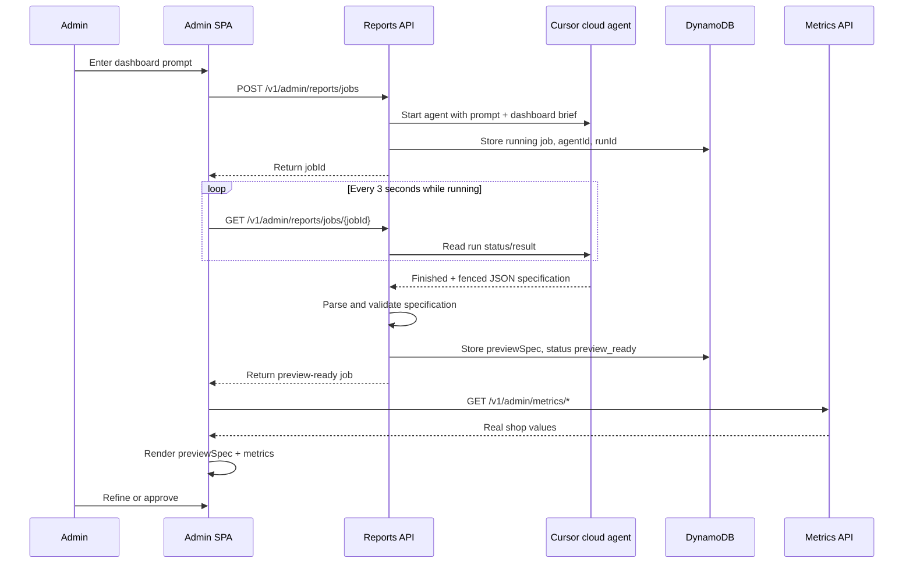

# Dashboard and report generation

This document explains how an admin prompt becomes a SmartShop dashboard, what the Cursor agent produces, how live metrics are added, and how colors and layouts change at runtime.

## Responsibilities

| Component | Responsibility |
| --- | --- |
| Admin SPA (`/admin/reports`) | Collect the prompt, poll the job, load metrics, render preview, refine, and approve |
| SmartShop reports API | Authorize admins, create/store jobs, call Cursor, parse the returned spec, and publish approved specs |
| Cursor cloud agent | Translate the prompt into a supported dashboard specification and generate files under the allowlisted directory |
| Metrics API | Compute read-only values from orders, products, and users |
| React report components | Turn the validated specification and metrics into UI |
| CSS | Supply the exact predefined colors and visual styling |

There is no separate “metrics agent.” Cursor does not query live metrics while interpreting the prompt. Metrics are loaded by the SPA from SmartShop's read-only API.

## High-level flow



## Runtime process

### 1. The page loads real metrics

`AdminReportsPage` loads:

- `GET /v1/admin/metrics/summary`
- `GET /v1/admin/metrics/products`
- `GET /v1/admin/metrics/stock`
- `GET /v1/admin/reports/published`

Metrics come from SmartShop data. The dashboard agent does not invent GMV, orders, stock, or customer counts.

### 2. The admin submits a prompt

The SPA sends:

```http
POST /v1/admin/reports/jobs
Content-Type: application/json

{"prompt":"Create a dark monthly command center with GMV, target pace, top products, and stockouts"}
```

The route is protected by the Cognito `admin` group.

### 3. The API starts a Cursor cloud agent

`services/api/src/admin/reports/cursor-cloud.ts` wraps the user prompt in `dashboardBrief()`. The brief tells Cursor to:

- Work only under `web/src/admin/reports/generated/`.
- Generate `Board.tsx`.
- Generate `dashboard.spec.json`.
- End its response with a fenced JSON specification.
- Use only supported KPIs, charts, layouts, themes, and windows.
- Bind UI to `/v1/admin/metrics/*`.
- Mark unsupported requests such as page-view conversion as unavailable.
- Never deploy AWS.

The cloud agent starts against `CURSOR_CLOUD_REPO` and `CURSOR_CLOUD_REF`, with `autoCreatePR: false`.

The API stores a DynamoDB job containing `jobId`, `agentId`, `runId`, prompt, status, and timestamps.

### 4. The SPA polls the job

While the job is `running`, the SPA calls:

```http
GET /v1/admin/reports/jobs/{jobId}
```

every three seconds. The API checks the corresponding Cursor run:

- Running: leave the job unchanged.
- Failed/cancelled: set the job to `error`.
- Finished: parse the JSON specification from the final agent response.

### 5. The API validates Cursor's specification

The response is parsed by `parseDashboardSpecFromText()` and validated with `dashboardSpecSchema`.

Supported values include:

| Property | Supported values |
| --- | --- |
| `layout` | `executive`, `pulse`, `command` |
| `theme` | `store`, `navy` |
| `windowDays` | `7`, `30` |
| `kpis` | `gmv`, `orderCount`, `aov`, `targetPace`, `stockouts`, `premiumShare` |
| `charts` | `gmvByDay`, `topProducts`, `deliveryMix`, `premium` |

Example:

```json
{
  "title": "Monthly command center",
  "kpis": ["gmv", "orderCount", "targetPace", "stockouts"],
  "charts": ["gmvByDay", "topProducts"],
  "unavailable": ["viewToOrder"],
  "gmvTargetCents": 1200000,
  "layout": "command",
  "theme": "navy",
  "windowDays": 30
}
```

If validation succeeds, the API stores it as `previewSpec` and sets the job to `preview_ready`. If Cursor finishes without a valid spec, the API retains the previous spec or uses `DEFAULT_DASHBOARD_SPEC` and records an explanatory message.

### 6. React chooses the visual component

The SPA chooses the active spec in this order:

1. Current job's `previewSpec`.
2. Published spec.
3. Default spec.

`ReportBoard` then selects a component:

| Layout | Component |
| --- | --- |
| `executive` | `DashboardPanel` |
| `pulse` | `PulseBoard` |
| `command` | `PulseBoard` with command classes |

The chosen component receives both the spec and separately loaded metrics:

```tsx
<Board
  spec={spec}
  summary={summary}
  products={products}
  stock={stock}
  badge={badge}
/>
```

Cursor determines the requested configuration. React performs the actual rendering.

## How colors change

Cursor does not generate runtime HTML or dynamically select arbitrary color values for the instant preview. It returns a validated theme/layout choice.

For a dark command-center request, Cursor should return:

```json
{
  "layout": "command",
  "theme": "navy"
}
```

`PulseBoard` converts this to CSS classes similar to:

```html
<section class="pulse-board command-board is-navy is-command">
```

Existing rules in `web/src/styles.css` then apply the exact palette:

- Dark background: `#0b1c2c`
- Light text: `#e8f4ef`
- Dark KPI cards: `#123044`
- Gold ring/bars: `#c9a227`
- Mint accents: `#8fd6c4`

The `store` theme uses the application's standard card and mint variables.

Therefore, the runtime pipeline is:

```text
User wording
  → Cursor chooses allowed layout/theme values
  → API validates and stores previewSpec
  → React converts values to component and class names
  → Existing CSS supplies exact colors
```

### Current theme limitation

The `executive` layout renders `DashboardPanel`, which does not currently apply `spec.theme`. A spec with:

```json
{"layout":"executive","theme":"navy"}
```

still uses the standard executive appearance. Dark styling currently requires `pulse` or `command`, and the agent brief directs dark command-center requests toward `command` + `navy`.

Arbitrary theme values such as `purple` are rejected by schema validation unless the schema, React classes, and CSS are extended.

## Cursor outputs

Cursor is instructed to produce:

1. `web/src/admin/reports/generated/dashboard.spec.json`
2. `web/src/admin/reports/generated/Board.tsx`
3. A fenced JSON spec in its final response

The immediate preview primarily uses the fenced JSON parsed into `previewSpec`.

`Board.tsx` is generated React code, not an HTML file. It only affects a deployed application after those generated code changes are promoted to the branch/build being deployed. The current cloud-agent call does not automatically create a PR or deploy the generated code.

## Refinement

After a successful preview, an admin can send:

```http
POST /v1/admin/reports/jobs/{jobId}/messages
Content-Type: application/json

{"prompt":"Use a 30-day window and make it a dark command-center layout"}
```

The backend resumes the same `agentId` and starts a new run, preserving conversation context. The job returns to `running`; polling and spec parsing repeat.

If the current run is still active, the API returns `409 JOB_RUNNING`.

## Approval and publication

Approval is allowed only after `preview_ready`:

```http
POST /v1/admin/reports/jobs/{jobId}/approve
```

The API copies the approved `previewSpec` into the DynamoDB record with `jobId = "published"`. Future page loads use that published layout.

In the current implementation:

- Approval publishes the JSON layout specification.
- Cursor does not receive AWS deployment credentials.
- Cursor does not run CDK or deploy CloudFront.
- Promotion/deployment of generated `Board.tsx` is a separate, later CI/CD step.

## Failure and fallback behavior

| Situation | Behavior |
| --- | --- |
| Non-admin request | `401` or `403` |
| Cursor API key missing | `503 CURSOR_NOT_CONFIGURED` |
| Cursor run fails | Job becomes `error`; last published dashboard remains available |
| Invalid JSON spec | Previous/default spec is retained |
| Unsupported metric requested | Added to `unavailable`; no invented value |
| No order data | UI displays `$0.00` or “No orders in this window” |
| Approve while running/error | `409 PREVIEW_REQUIRED` |

## Configuration

| Environment variable | Purpose |
| --- | --- |
| `CURSOR_DASHBOARD_API_KEY` | Server-side Cursor API key |
| `CURSOR_CLOUD_REPO` | Repository cloned by the cloud agent |
| `CURSOR_CLOUD_REF` | Starting branch/ref |
| `CURSOR_DASHBOARD_STUB=1` | Skip real Cursor calls in local tests |

The Cursor key must never appear in the SPA, `config.json`, generated dashboard files, or browser responses.

## Key implementation files

| File | Role |
| --- | --- |
| `web/src/pages/AdminReportsPage.tsx` | Prompt UI, polling, metrics loading, preview, refine, approve |
| `services/api/src/admin/reports/routes.ts` | Report job endpoints and authorization |
| `services/api/src/admin/reports/cursor-cloud.ts` | Cursor brief and create/resume/status calls |
| `services/api/src/admin/reports/store.ts` | DynamoDB jobs, parsing, preview and publication |
| `packages/shared/src/reports.ts` | Schemas and spec parser |
| `web/src/admin/reports/ReportBoard.tsx` | Layout-to-component selection |
| `web/src/admin/reports/PulseBoard.tsx` | Pulse/command rendering and theme classes |
| `web/src/admin/reports/DashboardPanel.tsx` | Executive rendering |
| `web/src/styles.css` | Runtime colors and visual styles |
| `web/src/admin/reports/generated/` | Cursor-generated spec and React board |

## Related documentation

Dashboard v2 is a separate design (HTML template, no git edits). It does not change this flow. See [dashboard-v2-design.md](dashboard-v2-design.md).

- [Phase 7 — Admin dashboard builder](usecase-stories/phase-7-admin-dashboard.md)
- [Runbook — Phase 7 dashboard builder](runbook.md#phase-7-dashboard-builder)
- [Project technical requirements](project-technical-requirements.md)
- [Generated report contract](../web/src/admin/reports/generated/README.md)
