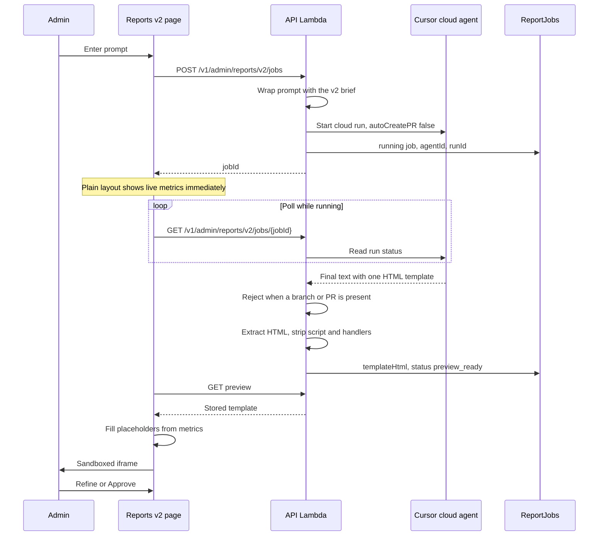

# Dashboard v2 design

**Status:** implemented. The admin page is `/admin/reports/v2`. Deploy still uses the existing API Lambda; this document is the behavior spec.

**Branch:** `dashboards-v2`

An admin types a prompt. The API Lambda starts a Cursor **cloud** agent, which clones this repo on Cursor’s machine and returns one HTML template. The Lambda stores that template. The admin page fills it with live metrics and shows it in a sandboxed iframe. The admin refines the same agent or approves the template.

The cloud clone is discarded. The run must not edit files, commit, or open a pull request. The published report is the stored template, not a git change.

This is separate from the Phase 7 dashboard. Phase 7 remains `/admin/reports`, a validated JSON spec, and React boards. See [dashboard-report-generation.md](dashboard-report-generation.md).

**Stories:** [usecase-stories/dashboard-v2.md](usecase-stories/dashboard-v2.md)

---

## Locked decisions

| Decision | Choice |
| --- | --- |
| Actor | Cognito group `admin` |
| Page | `/admin/reports/v2` in the existing SPA |
| Host of the agent call | Existing API Lambda (30 second timeout) |
| Agent | Cursor cloud agent. It clones `CURSOR_CLOUD_REPO` at `CURSOR_CLOUD_REF` (default ref `dashboards-v2`) |
| How Lambda starts it | Cloud agents HTTP API already used by Phase 7 (`POST /v1/agents`, follow-up run, `GET` run). Same lifecycle as `Agent.create`, `agent.send`, and `Agent.resume` |
| SDK package | `@cursor/sdk` stays in dev and CI scripts. It is not added to the Lambda bundle. The package ships a native bridge, and this function cannot wait on a cloud run |
| One-shot | Do not use `Agent.prompt`. Refine must keep the same `agentId` |
| Pull requests | `autoCreatePR: false`, `skipReviewerRequest: true` |
| Repo writes | Prompt forbids edits, commits, and pushes. A finished run that still reports a branch or pull request fails the job |
| Model output | One HTML document: inline CSS and inline SVG. Placeholders for metrics. No JavaScript |
| Where the template lives | DynamoDB job row. Approve copies it to `jobId = published-html` |
| Who draws numbers | The admin page’s own JavaScript. It loads metrics, fills placeholders, and sets a sandboxed iframe |
| Metrics | Existing read-only `/v1/admin/metrics/*`. The agent does not receive live figures and does not invent KPIs |
| CORS | Unchanged. The report document does not call the API |
| Shopping, assistant, Phase 7 | Unchanged |

---

## What the admin sees

`/admin/reports/v2` has four regions.

1. **Prompt.** A textarea for the admin’s words only (“monthly stock and delivery, print-friendly, dark header”). Read-only chips list the metric groups the template may use. The system brief is not editable.
2. **Window.** A 7-day / 30-day control owned by the page. Changing it refetches metrics and refills the current template. It does not start a Cursor run.
3. **Preview.** While the job is `running`, the page shows a plain built-in layout of the live metrics (trusted React, same numbers as the chips). When the job is `preview_ready`, that region becomes a sandboxed iframe of the filled template. The plain layout stays available if the run fails.
4. **Actions.** Refine and Approve stay disabled until `preview_ready`. Approve does not call Cursor.

A later visit to the page, with no job in progress, shows the approved template filled with current metrics. That view does not call Cursor.

---

## Runtime



The Lambda handler starts the run and returns. It does not call `wait()`. The shopping function timeout stays 30 seconds. The next `GET` reads Cursor status, the same polling model as Phase 7.

Generation is the slow step: the cloud machine clones the repo, then the model writes the template. The clone is unused. It is accepted so the run stays on the existing Lambda and the existing cloud-agent integration. Viewing an approved template does not pay that cost.

### Cloud run settings

| Setting | Value |
| --- | --- |
| Repo | `CURSOR_CLOUD_REPO`, default `https://github.com/jaganathan-vinod/smartshop` |
| Starting ref | `CURSOR_CLOUD_HTML_REF`, default `dashboards-v2`. This does not change Phase 7 `CURSOR_CLOUD_REF` (default `main`) |
| `autoCreatePR` | `false` |
| `skipReviewerRequest` | `true` |
| Name | `SmartShop dashboard v2` |

The API key is `CURSOR_DASHBOARD_API_KEY` or `CURSOR_API_KEY` on the Lambda. It never appears in the SPA, `config.json`, the template, or the job JSON returned to the browser.

`CURSOR_DASHBOARD_STUB=1` skips the real Cursor call in tests and returns a small fixed HTML template.

---

## Prompt contract

The textarea is only the admin sentence. The Lambda always wraps it.

The brief tells the agent:

- You are writing a SmartShop admin report template. This is not the shopping assistant.
- Reply with one fenced `html` block and nothing else.
- Use only the placeholder catalogue below. If the admin asks for a metric that is not in the catalogue, show the word “unavailable”. Do not invent a number, a product, or a customer.
- Amounts in placeholders are integer cents. The page formats them as USD. An empty window is filled as `$0.00` by the page.
- Inline CSS and inline SVG only. No `<script>`, no event-handler attributes, no external fonts, images, scripts, or stylesheets.
- Do not edit files. Do not commit. Do not push. Do not open a pull request.
- Do not read or quote secrets, `.env`, or API keys.

The follow-up brief for refine repeats those rules and includes the admin’s new sentence. It does not ask the agent to start over from an empty page unless the admin says so.

### Placeholder catalogue

Placeholders map to the existing metrics payloads. The agent does not see the values.

| Group | Source | Fields |
| --- | --- | --- |
| `summary` | `GET /v1/admin/metrics/summary` | `currency`, `windowDays`, `from`, `to`, `gmvCents`, `orderCount`, `aovCents`, `gmvTargetCents`, `premiumOrderCount`, `premiumUserCount`, `userCount` |
| `summary.gmvByDay` | same summary | `date`, `gmvCents`, `orderCount` |
| `summary.delivery` | same summary | `STANDARD`, `EXPRESS` |
| `products` | `GET /v1/admin/metrics/products` | `productId`, `name`, `units`, `gmvCents` (top 5) |
| `stock` | `GET /v1/admin/metrics/stock` | `productId`, `name`, `stockQty` (active SKUs at zero) |

`viewToOrder` stays unavailable. The summary already reports it in `unavailable`.

Derived values the page may expose as placeholders, computed in the SPA from those fields:

| Placeholder | Meaning |
| --- | --- |
| `{{summary.gmvPacePercent}}` | `gmvCents / gmvTargetCents` as an integer percent, empty when the target is 0 |
| `{{summary.deliveryStandardSharePercent}}` | STANDARD count over STANDARD + EXPRESS |
| `{{summary.deliveryExpressSharePercent}}` | EXPRESS count over STANDARD + EXPRESS |
| `{{summary.premiumOrderSharePercent}}` | premium orders over order count |

### Template syntax

The page implements this syntax. The agent must use only this syntax.

- Scalar: `{{summary.gmvCents}}`, `{{summary.delivery.STANDARD}}`.
- Repeat: `{{#each products}}…{{name}}…{{gmvCents}}…{{/each}}`. Same for `stock` and `summary.gmvByDay`. Inside a repeat, names are relative to the row.
- Unknown paths render an em dash. They do not throw and they do not call another service.
- Every substituted string is HTML-escaped before it is inserted.
- Cent fields are formatted as USD by the page (`8409` → `$84.09`). The template does not contain a hard-coded shop figure.

Example fragment the agent is allowed to return:

```html
<section>
  <h1>Delivery mix</h1>
  <p>{{summary.windowDays}} days · {{summary.gmvCents}} gross</p>
  <ul>
    {{#each products}}
    <li>{{name}} · {{units}} · {{gmvCents}}</li>
    {{/each}}
  </ul>
</section>
```

---

## HTML rules and preview

Before the template is stored, the Lambda:

1. Takes the single fenced `html` block. Zero blocks or more than one block → job `error`.
2. Rejects the run when Cursor reports a git branch or `prUrl`.
3. Removes `script`, `iframe`, `object`, `embed`, `link`, `meta` refresh, `foreignObject`, and any attribute whose name starts with `on`.
4. Removes `javascript:` URLs.
5. Allows inline `<style>` and `style` attributes, and SVG that survived the strip.
6. Rejects a template larger than 300 KB. The admin can refine toward a smaller page. DynamoDB items cap at 400 KB; the margin stays for the job metadata.

`GET …/preview` returns the stored template as JSON (`templateHtml`, `windowDays`). The browser fills placeholders and assigns the result to an iframe `srcdoc`.

Iframe:

- `sandbox` with neither `allow-scripts` nor `allow-same-origin`.
- The parent does not pass the admin token into the frame.

The preview response is admin-JWT only. The filled HTML is not a customer route and is not cached on a public CDN path.

Report CSS stays inside the iframe, so it does not restyle the admin chrome.

---

## API

All routes: Cognito JWT and group `admin`. Same `/{proxy+}` authorizer as the other admin APIs. Customers receive 403. Missing JWT receives 401.

| Method | Path | Body / result |
| --- | --- | --- |
| `POST` | `/v1/admin/reports/v2/jobs` | `{ prompt }` → `{ jobId, agentId, status: "running" }` |
| `GET` | `/v1/admin/reports/v2/jobs/{jobId}` | status, `errorMessage`. `templateHtml` only when `preview_ready`, `approved`, or the published row |
| `GET` | `/v1/admin/reports/v2/jobs/{jobId}/preview` | `{ templateHtml, windowDays }` after `preview_ready` |
| `POST` | `/v1/admin/reports/v2/jobs/{jobId}/messages` | `{ prompt }` refine. Resumes `agentId`. Status returns to `running` |
| `POST` | `/v1/admin/reports/v2/jobs/{jobId}/approve` | Copies the template onto `published-html`. Does not call Cursor |
| `GET` | `/v1/admin/reports/v2/published` | The approved template, or 404 when nothing is approved yet |

Prompt limits match Phase 7: create `8…4000` characters, refine `4…4000`.

`windowDays` on the job is `7` or `30`, taken from the page control at create time, default `7`. Refine does not change it unless the page sends a new value with the follow-up.

Statuses: `running`, `preview_ready`, `error`, `approved`. The published row’s status is `published`. These values already exist on the Phase 7 job schema. v2 rows add `kind: "html-v2"` so a Phase 7 reader does not treat them as a spec job.

### Errors

| Situation | Result |
| --- | --- |
| Non-admin | 401 or 403 |
| Cursor key missing | 503 `CURSOR_NOT_CONFIGURED` |
| Refine or approve while `running` | 409 `JOB_RUNNING` |
| Approve when status is not `preview_ready` | 409 `PREVIEW_REQUIRED` |
| Run failed, cancelled, or finished with a branch or PR | Job `error`. Previous `published-html` stays |
| Reply has no single HTML document | Job `error` |
| Template still contains script or handlers after the strip, or exceeds 300 KB | Job `error` |

---

## Data

Same `ReportJobs` table. v2 does not write `jobId = "published"` and does not write `previewSpec`.

| Item | Contents |
| --- | --- |
| `job_<id>` with `kind: "html-v2"` | prompt, `agentId`, `runId`, status, `windowDays`, `templateHtml`, `createdBy`, timestamps, optional `errorMessage` |
| `published-html` | The approved `templateHtml`, `windowDays` last used at approve, `kind: "html-v2"`, status `published` |

Phase 7 continues to own `published` and spec jobs. A v2 approve that called the Phase 7 publish function would replace the live React layout. The v2 approve path writes only `published-html`.

---

## Security

- The template is untrusted model output. Product names inside metrics are untrusted too, and are escaped at fill time.
- Model JavaScript is not executed. The page’s own code performs the fill and the iframe assignment.
- The iframe origin is opaque, so a missed handler cannot read the admin session. Same-origin injection (`dangerouslySetInnerHTML` on the admin page) is not the preview path.
- The report does not fetch `/v1/admin/metrics/*`. CORS `allowOrigins` stays the CloudFront SPA origin.
- The agent is not given shopping tools, CDK credentials, or a deploy role.
- Log `agentId` and `runId` when the run is started. Do not log the API key or the full template.

---

## Failure and fallback

| Situation | What the admin sees |
| --- | --- |
| Run still going | Plain metrics layout, prompt disabled, status running |
| Run failed or rejected | Plain metrics layout, `errorMessage`, last approved template unchanged |
| No orders in the window | Filled template shows `$0.00` and empty repeats |
| Unsupported metric in the wording | Template text “unavailable”, or an em dash for an unknown placeholder |
| Nothing approved yet | Plain metrics layout and the prompt |

---

## Implementation files

| Area | File |
| --- | --- |
| API routes | `services/api/src/admin/reports/html-routes.ts` |
| Job store | `services/api/src/admin/reports/html-store.ts` |
| Cloud brief and run | `services/api/src/admin/reports/cursor-html.ts` |
| HTML extract and strip | `services/api/src/admin/reports/html-template.ts` |
| Shared schema | `packages/shared/src/html-report.ts` |
| Admin page | `web/src/pages/AdminReportsV2Page.tsx` |
| Placeholder fill | `web/src/admin/reports/fillTemplate.ts` |

Phase 7 boards, `web/src/admin/reports/generated/`, cart, orders, assistant, AgentCore, the JWT authorizer, and CORS are unchanged. v2 adds its own classes in `styles.css` and does not change the Phase 7 theme rules.

---

## Related documentation

- [Dashboard v2 use cases](usecase-stories/dashboard-v2.md)
- [Phase 7 dashboard generation](dashboard-report-generation.md)
- [Phase 7 stories](usecase-stories/phase-7-admin-dashboard.md)
- [Technical requirements §2.5 and §5.9](project-technical-requirements.md)
- [Runbook](runbook.md#dashboard-v2)
