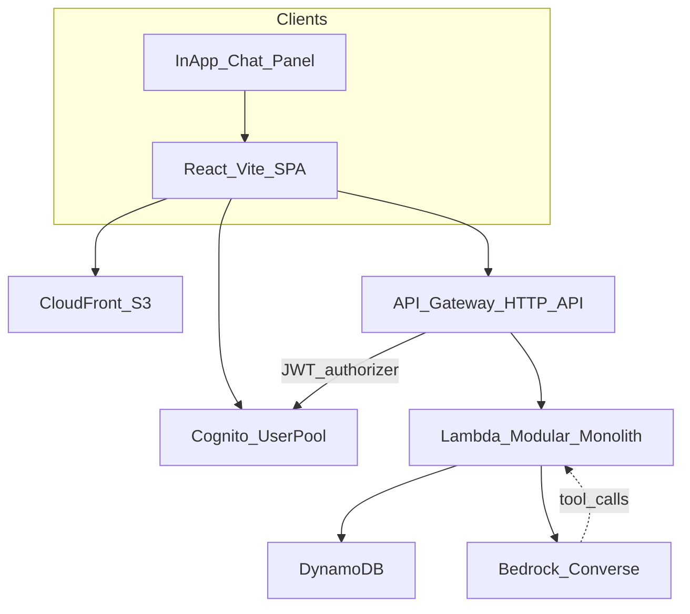

# SmartShop — Project Technical Requirements

**Product:** SmartShop  
**Version:** v1 (MVP)  
**Companion:** [project-business-requirements.md](project-business-requirements.md)

## 1. Stack

| Layer | Choice |
| --- | --- |
| Frontend | React, TypeScript, Vite |
| Frontend hosting | S3 + CloudFront |
| API | API Gateway HTTP API |
| Backend | Node.js TypeScript on AWS Lambda |
| Backend design | Modular monolith (one deployable, internal modules) |
| Data | DynamoDB (multi-table, one table per aggregate) |
| Auth | Amazon Cognito User Pool (email + password; self-service sign-up) |
| Validation | Zod at the HTTP boundary |
| Assistant | Amazon Bedrock Converse API with tool use |
| IaC | AWS CDK (TypeScript) |
| Region | `ap-southeast-1` |
| Git | Private GitHub repo `smartshop` |

## 2. Architecture

One CloudFront SPA, one HTTP API, one Lambda, several DynamoDB tables. Domain logic lives in modules. HTTP and Bedrock are adapters over the same modules.

### 2.1 Lambda modules

| Module | Responsibility |
| --- | --- |
| `identity` | Map Cognito `sub` to DynamoDB `Users`; copy `email`/`name` from JWT; expose `isPremium` |
| `catalog` | Product CRUD (admin) and public read/search |
| `cart` | Line items keyed by user |
| `pricing` | Pure function: cart lines + user + delivery → breakdown |
| `orders` | Confirm, number allocation, stock decrement, history |
| `assistant` | Conversation state, Bedrock Converse, tool dispatch |
| `http` | Hono (or equivalent) routes, JWT claims, Zod parsers |

Bedrock **does not** call API Gateway. Tools invoke in-process functions with the authenticated `userId`. Pricing, confirmation, and authorization stay identical for web and chat.

### 2.2 AWS sketch

- **Cognito User Pool** with email as username, self-registration enabled, and email verification required. No Google (or other) identity provider in v1.
- SPA uses Amplify Auth / Cognito SDK for `signUp`, `confirmSignUp`, and `signIn`. Public app client (no client secret).
- Sign-up attributes: `email`, `name` (display name). Password policy: Cognito default (min 8, upper, lower, number).
- HTTP API JWT authorizer against this User Pool. `GET /v1/products` may be unauthenticated. `/v1/admin/*` requires Cognito group `admin`.
- Lambda on Node.js 22, ARM64, 512 MB, timeout 30 s (chat route 29 s).
- CloudFront SPA with `/index.html` error fallback for client routing. API on `api.smartshop.*` or `/api/*` origin.
- Bedrock via IAM (no API keys). No Google OAuth secrets.

### 2.3 Cognito User Pool (credentials)

Amazon Cognito is the only credential store.

| Concern | Decision |
| --- | --- |
| Username | Email |
| Password | User Pool hashes and validates; never stored in DynamoDB or Lambda logs |
| Self-registration | Enabled |
| Required attributes | `email`, `name` (display name from the sign-up form) |
| Verification | Email code before first sign-in (`/confirm`) |
| App client | Public SPA client, no secret, auth flows `USER_PASSWORD_AUTH` / `USER_SRP_AUTH` |
| Hosted UI | Not required; SmartShop owns `/signup` and `/login` |
| Social IdPs | Out of scope for v1 |
| Application profile | DynamoDB `Users` keyed by `sub`; `isPremium` is not a Cognito attribute in v1 |

Sign-up / sign-in sequence:

1. `/signup` → Cognito `SignUp` (email, password, name).
2. `/confirm` → Cognito `ConfirmSignUp` (email, code).
3. `/login` → Cognito `InitiateAuth` → ID + access tokens.
4. SPA calls `GET /v1/me` with the ID token; identity module upserts DynamoDB `Users`.

Do not add SmartShop REST endpoints that accept raw passwords.

## 3. Non-functional requirements

- API p95 latency under 500 ms excluding Bedrock.
- Cart and order writes are per-user; no cross-customer leakage.
- Confirm is idempotent: `Idempotency-Key` header, or chat `conversationId` + turn, so a double submit does not create two orders.
- Amounts are integer cents. Currency is USD (`ISO-4217`).
- Errors: `{ "error": { "code": string, "message": string, "details": unknown } }`.

## 4. Data model (DynamoDB)

### 4.1 Products

- PK: `productId` (ULID)
- Attributes: `name`, `nameLower`, `description`, `category`, `unitPriceCents`, `currency`, `stockQty`, `imageUrl`, `active`, `createdAt`, `updatedAt`
- Access: `GetItem` by id. v1 search is `Scan` + filter on `nameLower` / `category` (small catalogue). Add GSI `category-index` if category browse is hot.

### 4.2 Users

- PK: `userId` (Cognito `sub`)
- Attributes: `email`, `displayName`, `isPremium` (bool), `createdAt`, `updatedAt`
- Created on first authenticated request (`identity` upsert from Cognito JWT `sub`, `email`, `name`).
- Not used for passwords.

### 4.3 Carts (one item per line)

- PK: `userId`
- SK: `productId`
- Attributes: `quantity`, `updatedAt`
- `Query` PK = user loads the cart. Empty cart = no items.

### 4.4 Orders

- PK: `userId`
- SK: `ORDER#<createdAtIso>#<orderId>` (newest-first queries)
- Attributes: `orderId`, `orderNumber`, `status` (`CONFIRMED`), `deliveryMethod`, `items[]` (productId, name, qty, unitPriceCents), `breakdown` (all cent fields), `isPremiumAtPurchase`, `createdAt`
- GSI `orderNumber-index`: PK `orderNumber`
- Optional GSI `orderId-index` if the API looks up by opaque id only

### 4.5 OrderNumbers

- PK: `COUNTER`
- Atomic `ADD` on `lastValue` to allocate `SS-YYYYMMDD-#####`

### 4.6 Conversations

- PK: `userId`
- SK: `CONV#<conversationId>`
- Attributes: message history (or child items if payloads grow), `pendingDeliveryMethod`, `updatedAt`

Admin audit table is out of scope for v1; CloudWatch logs are enough.

## 5. API endpoints

Version prefix `/v1`. JSON in/out. Zod schemas per route.

### 5.1 Catalogue (public GET)

- `GET /v1/products?q=&category=&limit=`
- `GET /v1/products/{productId}`

### 5.2 Admin (Cognito group `admin`)

- `POST /v1/admin/products` — create
- `PUT /v1/admin/products/{productId}` — replace
- `PATCH /v1/admin/products/{productId}` — partial (price, stock, active)
- `PATCH /v1/admin/users/{userId}/premium` — `{ "isPremium": true }`

### 5.3 Session (customer JWT)

- `GET /v1/me` — `{ userId, email, displayName, isPremium }`

### 5.4 Cart (customer JWT)

- `GET /v1/cart` — lines plus live unit prices
- `PUT /v1/cart/items` — `{ productId, quantity }` upsert
- `PATCH /v1/cart/items/{productId}` — `{ quantity }`
- `DELETE /v1/cart/items/{productId}`

### 5.5 Quote and order (customer JWT)

- `POST /v1/quotes` — `{ "deliveryMethod": "STANDARD" | "EXPRESS" }` → breakdown and line items. Does **not** create an order.
- `POST /v1/orders` — `{ "deliveryMethod": "...", "confirm": true }` only. Reprices, checks stock, decrements, clears cart, returns `{ orderId, orderNumber, breakdown, items, status }`. Reject if `confirm !== true`, cart empty, or stock fails.
- `GET /v1/orders` — caller’s history, newest first
- `GET /v1/orders/{orderId}`

### 5.6 Assistant (customer JWT)

- `POST /v1/assistant/messages` — `{ conversationId?, message }`
- Response: `{ conversationId, reply, toolsUsed[], orderNumber? }`

There are no separate chat endpoints for cart or order. The model uses tools that wrap `cart`, `pricing`, and `orders`.

### 5.7 Bedrock tools

| Tool | Maps to |
| --- | --- |
| `search_products` | catalog search |
| `get_product` | catalog get |
| `get_cart` | cart get |
| `upsert_cart_item` | cart put/patch |
| `remove_cart_item` | cart delete |
| `set_delivery` | conversation delivery choice |
| `get_quote` | pricing |
| `confirm_order` | orders confirm (guarded) |
| `list_orders` | orders list |
| `get_order` | orders get |

`confirm_order` is allowed only after a quote was presented in the conversation **and** the latest user message is explicit confirmation. Max tool iterations: 8.

## 6. Frontend surface

| Route | Purpose |
| --- | --- |
| `/signup` | Create account: email, password, confirm password, display name |
| `/confirm` | Enter Cognito email verification code |
| `/login` | Sign in with email and password |
| `/` | Catalogue browse/search |
| `/products/:id` | Product detail |
| `/cart` | Cart lines |
| `/checkout` | Delivery, breakdown, confirm |
| `/orders` | History |
| `/orders/:id` | Order detail |
| `/chat` or drawer | Assistant |

Checkout must show: lines, subtotal, premium discount (or “not applied”), delivery choice, delivery fee, tax, **total**, and a **Place order** control that stays disabled until the customer explicitly confirms (checkbox or equivalent).

Chat must show assistant text plus the same numeric breakdown when a quote tool ran.

## 7. Security

- JWT authorizer on API Gateway; Lambda also checks `sub` and groups.
- Admin routes require group `admin`.
- Least-privilege IAM: Lambda can read/write only SmartShop tables and invoke Bedrock Converse.
- CORS locked to the CloudFront origin in Phase 6.
- Zod validation on every mutating request.
- Secrets never in git (see [github-setup.md](github-setup.md)).

## 8. Testing requirements

- Pricing: table-driven tests for premium vs not, STANDARD vs EXPRESS, empty cart.
- Orders: missing `confirm`, stock conditional-write failure, idempotent replay.
- Authz: customer cannot hit admin; customer A cannot `GET` customer B’s order.
- Assistant: fixture that must quote before confirm; reject confirm without user yes.
- UI (Phase 4): sign up → confirm email → sign in → browse → cart → quote → confirm → history in the browser.

## 9. Implementation phases

Work happens only in `/Users/dhivya/vinod/cursor-projects/smartshop` after the workspace root is this folder.

| Phase | Scope |
| --- | --- |
| Docs (this drop) | Business, technical, use-case, GitHub setup markdown |
| 0 Foundation | CDK, Cognito User Pool (email/password, self-sign-up), HTTP API, Lambda stub, DynamoDB, S3/CloudFront, Zod types, seed |
| 1 Catalogue + identity | Product GET/search, `/me`, admin APIs |
| 2 Cart + pricing | Cart CRUD, `POST /v1/quotes` |
| 3 Orders | Confirm, numbers, stock, history, idempotency |
| 4 SPA | React Vite UI, `/signup` `/confirm` `/login`, CloudFront |
| 5 Assistant | Bedrock tools + confirmation guard in code |
| 6 Hardening | IAM, logs/alarms, CORS, Cognito admin bootstrap README |

Phase use-case stories: [usecase-stories/](usecase-stories/).
