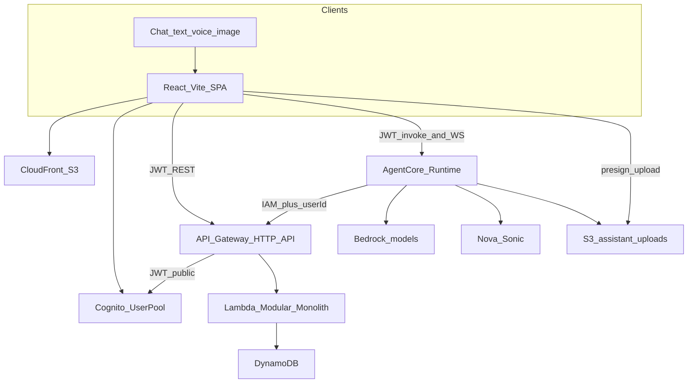

# SmartShop — Project Technical Requirements

**Product:** SmartShop  
**Version:** v1 (MVP)  
**Companion:** [project-business-requirements.md](project-business-requirements.md)

## 1. Stack

| Layer | Choice |
| --- | --- |
| Frontend | React, TypeScript, Vite |
| Frontend hosting | S3 + CloudFront |
| API | API Gateway HTTP API |
| Backend | Node.js TypeScript on AWS Lambda |
| Backend design | Modular monolith (one deployable, internal modules) |
| Data | DynamoDB (multi-table, one table per aggregate) |
| Auth | Amazon Cognito User Pool (email + password; self-service sign-up) |
| Validation | Zod at the HTTP boundary |
| Assistant | Amazon Bedrock AgentCore Runtime (text, voice, image); tools call SmartShop over IAM |
| IaC | AWS CDK (TypeScript) |
| Region | `ap-southeast-1` |
| Git | Private GitHub repo `smartshop` |

## 2. Architecture

One CloudFront SPA, one HTTP API, one shopping Lambda, AgentCore Runtime for the assistant, several DynamoDB tables. Domain logic lives in Lambda modules. The SPA uses JWT for web shopping. The assistant uses AgentCore Runtime; tools reach those modules over **IAM service-to-service**, with `userId` injected from the inbound Cognito JWT.

### 2.1 Lambda modules

| Module | Responsibility |
| --- | --- |
| `identity` | Map Cognito `sub` to DynamoDB `Users`; copy `email`/`name` from JWT; expose `isPremium` |
| `catalog` | Product CRUD (admin) and public read/search |
| `cart` | Line items keyed by user |
| `pricing` | Pure function: cart lines + user + delivery → breakdown |
| `orders` | Confirm, number allocation, stock decrement, history |
| `assistant` | Internal IAM tool dispatch, conversation guard state (quote presented, pending delivery) |
| `http` | Hono (or equivalent) routes, JWT claims, IAM internal routes, Zod parsers |

The shopping Lambda **does not** run the Bedrock / Sonic model loop. AgentCore Runtime owns text, voice, and image turns. Tools call `POST /v1/internal/assistant/tools` (IAM). Runtime sets `X-SmartShop-User-Id` from the inbound JWT `sub`; the model cannot choose `userId`. Pricing, confirmation (`confirm: true`), and admin exclusion stay identical for web and assistant.

**Deferred:** AgentCore Gateway MCP in front of public `/v1/*`, and on-behalf-of / JWT passthrough so tools call the customer API as the user. Phase 5 is service-to-service only.

### 2.2 AWS sketch

- **Cognito User Pool** with email as username, self-registration enabled, and email verification required. No Google (or other) identity provider in v1.
- SPA uses Amplify Auth / Cognito SDK for `signUp`, `confirmSignUp`, and `signIn`. Public app client (no client secret).
- Sign-up attributes: `email`, `name` (display name). Password policy: Cognito default (min 8, upper, lower, number).
- HTTP API JWT authorizer against this User Pool for public customer/admin routes. `GET /v1/products` may be unauthenticated. `/v1/admin/*` requires Cognito group `admin`. `/v1/internal/*` uses an **IAM** authorizer (AgentCore Runtime role only).
- Lambda on Node.js 22, ARM64, 512 MB, timeout 30 s. Assistant sessions are **not** held on this Lambda (voice WebSocket lives on AgentCore Runtime).
- CloudFront SPA with `/index.html` error fallback for client routing. API on `api.smartshop.*` or `/api/*` origin.
- AgentCore Runtime (HTTP invoke + WebSocket `/ws`) and Bedrock models (text/vision + Nova Sonic) via IAM. No Google OAuth secrets.
- Assistant image uploads: dedicated S3 prefix with a short lifecycle; SPA uses a customer-JWT presign, Runtime reads with IAM.

### 2.3 Cognito User Pool (credentials)

Amazon Cognito is the only credential store.

| Concern | Decision |
| --- | --- |
| Username | Email |
| Password | User Pool hashes and validates; never stored in DynamoDB or Lambda logs |
| Self-registration | Enabled |
| Required attributes | `email`, `name` (display name from the sign-up form) |
| Verification | Email code before first sign-in (`/confirm`) |
| App client | Public SPA client, no secret, auth flows `USER_PASSWORD_AUTH` / `USER_SRP_AUTH` |
| Hosted UI | Not required; SmartShop owns `/signup` and `/login` |
| Social IdPs | Out of scope for v1 |
| Application profile | DynamoDB `Users` keyed by `sub`; `isPremium` is not a Cognito attribute in v1 |

Sign-up / sign-in sequence:

1. `/signup` → Cognito `SignUp` (email, password, name).
2. `/confirm` → Cognito `ConfirmSignUp` (email, code).
3. `/login` → Cognito `InitiateAuth` → ID + access tokens.
4. SPA calls `GET /v1/me` with the ID token; identity module upserts DynamoDB `Users`.

Do not add SmartShop REST endpoints that accept raw passwords.

### 2.4 Phase 5 must not change existing behaviour

Phase 5 is **additive**. Web shopping from Phases 1–4 and 6 stays the source of truth. Assistant tools **call** `catalog` / `cart` / `pricing` / `orders`; they do not replace those HTTP APIs or rewrite their contracts.

**Frozen (do not change behaviour or authorizer):**

| Surface | Today (do not regress) |
| --- | --- |
| `GET /v1/health`, `GET /v1/products`, `GET /v1/products/{id}` | `HttpNoneAuthorizer` (public) |
| All other existing `/v1/*` (cart, quotes, orders, `/me`, admin) | Cognito JWT via `/{proxy+}` and `JWT_PROTECTED_METHODS` |
| JWT method list | GET, POST, PUT, PATCH, DELETE only — never `ANY` or `OPTIONS` (CORS preflight must stay 204) |
| CORS | `allowOrigins` = CloudFront SPA only; existing `allowHeaders` (`Authorization`, `Content-Type`, `Idempotency-Key`) remain |
| Cognito | Same User Pool, SPA client, groups, email/password flows |
| DynamoDB keys | Existing table partition/sort keys and GSIs unchanged. Conversations already exists; Phase 5 only writes new item attributes |
| Pricing / orders | Same cent math, `confirm: true`, stock decrement, `Idempotency-Key` |
| SPA shopping | `/`, `/c/:category`, `/products/:id`, `/cart`, `/checkout`, `/orders`, signup/login/confirm, mint storefront — no behaviour change |
| `config.json` required keys | `apiUrl`, `userPoolId`, `userPoolClientId`, `region` — new keys are **optional extras** only |
| Alarms / CloudFront SPA fallback | Unchanged |

**Allowed additions only:** AgentCore Runtime (+ outputs), a **new explicit** IAM route `POST /v1/internal/assistant/tools` (more specific than `/{proxy+}`), `POST /v1/assistant/uploads` on the existing JWT proxy, upload S3 prefix, `ChatPage` implementation, optional `config.json` fields (`runtimeArn` / invoke URL / WebSocket URL), new tests.

**Must not:**

- Change the HTTP API default authorizer, or convert `/{proxy+}` to IAM / dual JWT+IAM.
- Put internal tools only on `/{proxy+}` (that would require a customer JWT and could expose tools to the SPA).
- Change `withClaims` so JWT routes lose `sub` / groups. IAM tool requests are a **separate** identity path; JWT routes keep today’s claim middleware.
- Dual-authorize existing cart/quote/order routes (JWT **or** IAM) — those stay JWT-only.
- Rename or remove existing Hono routes, shared Zod cart/order/quote schemas, or SPA `api.ts` shopping calls.
- Tighten CORS `allowOrigins` further or drop `Idempotency-Key`.
- Proxy voice or the model loop through the shopping Lambda.

**Highest breakage risk:** API Gateway HTTP API matches `/{proxy+}` JWT for any new `POST /v1/...` unless a **more specific** `addRoutes` entry exists. Internal tools **must** be that specific IAM route. Browser CORS is unused by Runtime (service-to-service); do not expand CORS for SigV4 headers unless a browser starts calling internal routes (it must not).

## 3. Non-functional requirements

- API p95 latency under 500 ms excluding AgentCore / Bedrock.
- Cart and order writes are per-user; no cross-customer leakage.
- Confirm is idempotent: `Idempotency-Key` header, or chat `conversationId` + turn, so a double submit does not create two orders.
- Amounts are integer cents. Currency is USD (`ISO-4217`).
- Errors: `{ "error": { "code": string, "message": string, "details": unknown } }`.

## 4. Data model (DynamoDB)

### 4.1 Products

- PK: `productId` (ULID)
- Attributes: `name`, `nameLower`, `description`, `category`, `unitPriceCents`, `currency`, `stockQty`, `imageUrl`, `active`, `createdAt`, `updatedAt`
- Access: `GetItem` by id. v1 search is `Scan` + filter on `nameLower` / `category` (small catalogue). Add GSI `category-index` if category browse is hot.

### 4.2 Users

- PK: `userId` (Cognito `sub`)
- Attributes: `email`, `displayName`, `isPremium` (bool), `createdAt`, `updatedAt`
- Created on first authenticated request (`identity` upsert from Cognito JWT `sub`, `email`, `name`).
- Not used for passwords.

### 4.3 Carts (one item per line)

- PK: `userId`
- SK: `productId`
- Attributes: `quantity`, `updatedAt`
- `Query` PK = user loads the cart. Empty cart = no items.

### 4.4 Orders

- PK: `userId`
- SK: `ORDER#<createdAtIso>#<orderId>` (newest-first queries)
- Attributes: `orderId`, `orderNumber`, `status` (`CONFIRMED`), `deliveryMethod`, `items[]` (productId, name, qty, unitPriceCents), `breakdown` (all cent fields), `isPremiumAtPurchase`, `createdAt`
- GSI `orderNumber-index`: PK `orderNumber`
- Optional GSI `orderId-index` if the API looks up by opaque id only

### 4.5 OrderNumbers

- PK: `COUNTER`
- Atomic `ADD` on `lastValue` to allocate `SS-YYYYMMDD-#####`

### 4.6 Conversations

- PK: `userId`
- SK: `CONV#<conversationId>`
- Attributes: `runtimeSessionId`, `pendingDeliveryMethod`, `quotePresentedAt`, `lastQuoteBreakdown` (cent fields), optional truncated history, `updatedAt`
- Maps one AgentCore Runtime session across text, voice, and image. AgentCore Memory may cache turns; this table is the confirmation-guard source of truth.

Admin audit table is out of scope for v1; CloudWatch logs are enough.

## 5. API endpoints

Version prefix `/v1`. JSON in/out. Zod schemas per route.

### 5.1 Catalogue (public GET)

- `GET /v1/products?q=&category=&limit=`
- `GET /v1/products/{productId}`

### 5.2 Admin (Cognito group `admin`)

- `POST /v1/admin/products` — create
- `PUT /v1/admin/products/{productId}` — replace
- `PATCH /v1/admin/products/{productId}` — partial (price, stock, active)
- `PATCH /v1/admin/users/{userId}/premium` — `{ "isPremium": true }`

### 5.3 Session (customer JWT)

- `GET /v1/me` — `{ userId, email, displayName, isPremium }`

### 5.4 Cart (customer JWT)

- `GET /v1/cart` — lines plus live unit prices
- `PUT /v1/cart/items` — `{ productId, quantity }` upsert
- `PATCH /v1/cart/items/{productId}` — `{ quantity }`
- `DELETE /v1/cart/items/{productId}`

### 5.5 Quote and order (customer JWT)

- `POST /v1/quotes` — `{ "deliveryMethod": "STANDARD" | "EXPRESS" }` → breakdown and line items. Does **not** create an order.
- `POST /v1/orders` — `{ "deliveryMethod": "...", "confirm": true }` only. Reprices, checks stock, decrements, clears cart, returns `{ orderId, orderNumber, breakdown, items, status }`. Reject if `confirm !== true`, cart empty, or stock fails.
- `GET /v1/orders` — caller’s history, newest first
- `GET /v1/orders/{orderId}`

### 5.6 Assistant (customer JWT + Runtime)

The SPA does **not** send chat turns to the shopping Lambda. It invokes AgentCore Runtime with the Cognito JWT. Runtime `RequestHeaderConfiguration` allowlists `Authorization` so the agent container receives that JWT and can copy `sub` into `X-SmartShop-User-Id` (AgentCore otherwise drops the header after edge validation).

- Runtime HTTP: `InvokeAgentRuntime` — `{ conversationId?, message?, imageObjectKey? }` → streamed `{ conversationId, reply, toolsUsed[], orderNumber? }`
- Text/vision model: Amazon Nova Lite via the APAC inference profile `apac.amazon.nova-lite-v1:0` (`ap-southeast-1` does not support on-demand `amazon.nova-lite-v1:0`)
- Runtime WebSocket: `/ws` for Nova Sonic (audio both ways; same tools)
- `POST /v1/assistant/uploads` — customer JWT; returns `{ uploadUrl, objectKey }` for a short-lived image put

`config.json` / CDK outputs **add** Runtime ARN (or invoke URL) and WebSocket URL. Required keys `apiUrl`, `userPoolId`, `userPoolClientId`, and `region` stay as they are so the existing SPA boot path does not break. There are no separate public chat endpoints for cart or order.

### 5.7 Assistant tools

Same tool names for text, voice, and image. Runtime implements the loop; Lambda executes the tool.

| Tool | Maps to |
| --- | --- |
| `search_products` | catalog search |
| `get_product` | catalog get |
| `get_cart` | cart get |
| `upsert_cart_item` | cart put/patch |
| `remove_cart_item` | cart delete |
| `set_delivery` | conversation delivery choice |
| `get_quote` | pricing |
| `confirm_order` | orders confirm (guarded) |
| `list_orders` | orders list |
| `get_order` | orders get |

`confirm_order` is allowed only after a quote was presented in the conversation **and** the latest user turn is explicit confirmation (typed yes, confirm control, or spoken yes). Max tool iterations: 8. Admin APIs are not tools.

### 5.8 Internal tool API (IAM only)

- `POST /v1/internal/assistant/tools` — SigV4 from the AgentCore Runtime role
- Body: `{ conversationId, tool, args }` — `args` must not include `userId`
- Header: `X-SmartShop-User-Id` = Cognito `sub` copied from the inbound JWT by Runtime
- Response: tool JSON (cart, quote breakdown, order, or error)

Reject if the caller is not IAM, if the header is missing, or if `tool` is not in the table above. Ignore any `userId` inside `args`. Customer JWT must not authorize this route.

CDK: add an **explicit** `httpApi.addRoutes` for this path with an IAM authorizer. Do not rely on `/{proxy+}` (JWT). Do not change `JWT_PROTECTED_METHODS`. Tools invoke existing `cart` / `pricing` / `orders` functions; they do not duplicate HTTP handlers or alter those routes.

## 6. Frontend surface

| Route | Purpose |
| --- | --- |
| `/signup` | Create account: email, password, confirm password, display name |
| `/confirm` | Enter Cognito email verification code |
| `/login` | Sign in with email and password |
| `/` | Catalogue browse/search |
| `/products/:id` | Product detail |
| `/cart` | Cart lines |
| `/checkout` | Delivery, breakdown, confirm |
| `/orders` | History |
| `/orders/:id` | Order detail |
| `/chat` or drawer | Assistant: text, image attach, voice (replace the Phase 4 stub only) |

Checkout must show: lines, subtotal, premium discount (or “not applied”), delivery choice, delivery fee, tax, **total**, and a **Place order** control that stays disabled until the customer explicitly confirms (checkbox or equivalent).

Chat must show assistant text plus the same numeric breakdown when a quote tool ran. Voice must speak those cent fields, not invented amounts. Image attach uploads via the presign, then Runtime.

## 7. Security

- JWT authorizer on public API Gateway routes; IAM authorizer on `/v1/internal/*`. Lambda also checks `sub` and groups on JWT routes.
- Admin routes require group `admin`.
- Least-privilege IAM: Lambda can read/write only SmartShop tables and the assistant-upload prefix (presign). Runtime role can invoke internal tools, read uploads, and call Bedrock / Nova Sonic. Runtime cannot call `/v1/admin/*`.
- Internal assistant routes: IAM authorizer only. Public cart/order routes: JWT only.
- CORS locked to the CloudFront origin in Phase 6.
- Zod validation on every mutating request.
- Secrets never in git (see [github-setup.md](github-setup.md)).

## 8. Testing requirements

- Pricing: table-driven tests for premium vs not, STANDARD vs EXPRESS, empty cart.
- Orders: missing `confirm`, stock conditional-write failure, idempotent replay.
- Authz: customer cannot hit admin; customer A cannot `GET` customer B’s order.
- Assistant: fixture that must quote before confirm; reject confirm without user yes (text and spoken). Internal tools reject customer JWT and forged `userId` in args.
- UI (Phase 4): sign up → confirm email → sign in → browse → cart → quote → confirm → history in the browser. **This path must still pass after Phase 5** (US-5.08). Existing unit tests for pricing, orders, authz, and catalog stay green with no contract changes.

## 9. Implementation phases

Work happens only in `/Users/dhivya/vinod/cursor-projects/smartshop` after the workspace root is this folder.

| Phase | Scope |
| --- | --- |
| Docs (this drop) | Business, technical, use-case, GitHub setup markdown |
| 0 Foundation | CDK, Cognito User Pool (email/password, self-sign-up), HTTP API, Lambda stub, DynamoDB, S3/CloudFront, Zod types, seed |
| 1 Catalogue + identity | Product GET/search, `/me`, admin APIs |
| 2 Cart + pricing | Cart CRUD, `POST /v1/quotes` |
| 3 Orders | Confirm, numbers, stock, history, idempotency |
| 4 SPA | React Vite UI, `/signup` `/confirm` `/login`, CloudFront |
| 5 Assistant | AgentCore Runtime (text, voice, image), IAM service-to-service tools, confirmation guard in code. Additive only — see §2.4 |
| 6 Hardening | IAM, logs/alarms, CORS, Cognito admin bootstrap README |

Phase use-case stories: [usecase-stories/](usecase-stories/).
