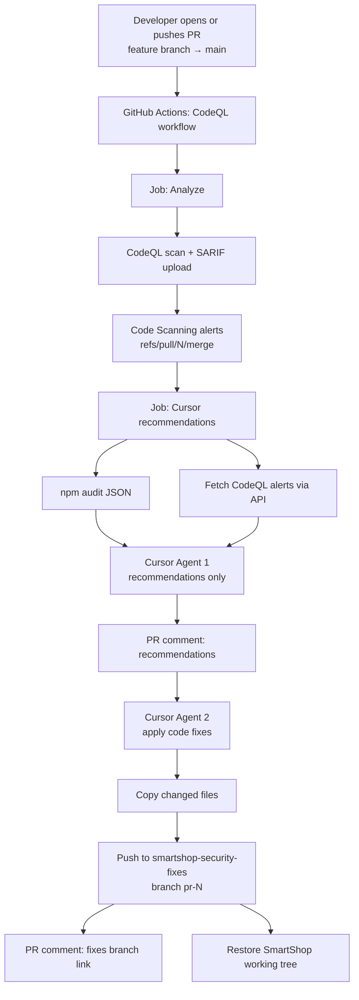

# Security CI: CodeQL, Cursor recommendations, and fix mirroring

This document describes how SmartShop pull requests run CodeQL, ask Cursor for advice, and mirror applied fixes into a separate repository—without committing audit logs or fix commits onto the PR branch.

## Goals

- Scan PRs with **CodeQL** (JavaScript/TypeScript).
- Collect **npm audit** findings.
- Send both to **Cursor** for **recommendations only**, posted as a **PR comment**.
- Optionally run Cursor again to **apply code fixes**, then push changed files to **`smartshop-security-fixes`** on branch **`pr-<PR_NUMBER>`**.
- Keep the SmartShop PR branch clean (no bot commits for logs or fixes).

## Architecture



## Triggers

Workflow: [`.github/workflows/codeql.yml`](../.github/workflows/codeql.yml)

| Event | What runs |
|-------|-----------|
| `pull_request` → `main` | CodeQL analyze **and** Cursor recommend/fix job |
| `push` → `main` | CodeQL analyze only (no Cursor recommend job) |

Every new commit on an open PR re-triggers the workflow (`synchronize`). You do not need to open a new PR for each push.

## Jobs

### 1. Analyze

- Language: `javascript-typescript`
- Queries: `security-extended`
- Uploads results to GitHub **Code scanning**

PR findings appear under **Security → Code scanning** filtered by `pr:<number>`, often on ref `refs/pull/<number>/merge`.

### 2. Cursor recommendations (`recommend`)

Runs only on `pull_request`, after analyze succeeds.

1. Checks out the PR head branch.
2. Runs `npm audit` (JSON under `logs/`; **not** committed).
3. Runs [`scripts/pr-audit-agent.ts`](../scripts/pr-audit-agent.ts):
   - Fetches CodeQL alerts (PR merge/head refs, with retries).
   - **Cursor Agent 1** (`Agent.prompt`): markdown recommendations; no file edits.
   - Posts recommendations as a **PR comment** (+ Actions step summary).
   - **Cursor Agent 2** (`Agent.create` + `send`): applies focused code fixes in the checkout.
   - Pushes **only changed files** (+ `meta/pr-<N>.json`) to the security-fixes repo.
   - Restores the SmartShop working tree so the PR branch is unchanged.
   - Posts a second PR comment with the target branch URL.

## Repositories

| Repo | Role |
|------|------|
| `jaganathan-vinod/smartshop` | Source app; PRs and CodeQL live here |
| `jaganathan-vinod/smartshop-security-fixes` | Mirror of automated fix files on `pr-<N>` branches |

Target repo is configurable via `SECURITY_FIXES_REPO` (default in the workflow: `jaganathan-vinod/smartshop-security-fixes`).

## Secrets

Configure on **smartshop**: **Settings → Secrets and variables → Actions**.

| Secret | Created by | Purpose |
|--------|------------|---------|
| `GITHUB_TOKEN` | GitHub (automatic) | PR comments and CodeQL alerts API **on smartshop**. Do not create manually. |
| `CURSOR_TO_GIT_API_KEY` | You (Cursor Dashboard → API Keys) | Authenticate `@cursor/sdk` agents |
| `SECURITY_FIXES_TOKEN` | You (GitHub PAT) | Push to **smartshop-security-fixes** (`GITHUB_TOKEN` cannot write other repos) |

### Creating `SECURITY_FIXES_TOKEN`

1. [Fine-grained personal access tokens](https://github.com/settings/personal-access-tokens) → **Generate new token**.
2. Resource owner: your user/org.
3. Repository access: **Only** `smartshop-security-fixes`.
4. Permission: **Contents → Read and write**.
5. Generate, copy the token.
6. On **smartshop** → Actions secrets → **New repository secret**:
   - Name: `SECURITY_FIXES_TOKEN`
   - Value: the PAT

## Environment variables (CI)

Set in the recommend job step:

| Variable | Meaning |
|----------|---------|
| `APPLY_SECURITY_FIXES` | `true` / `false` — skip fix agent + push when `false` |
| `SECURITY_FIXES_REPO` | `owner/name` of the fixes mirror repo |
| `PR_NUMBER` | Current pull request number (branch name becomes `pr-<PR_NUMBER>`) |
| `NPM_AUDIT_PATH` | Path to npm audit JSON |

## Why CodeQL alerts must use the PR ref

Alerts for a PR are often stored against `refs/pull/<N>/merge`, not `refs/heads/<branch>`. Querying only the branch ref (or default-branch `state=open`) can return `[]` even when Security UI shows findings.

The agent script tries, in order:

1. `pr=<N>`
2. `refs/pull/<N>/merge`
3. `refs/pull/<N>/head`
4. Branch refs
5. Short retries after analyze (SARIF indexing lag)

## Local / manual run

```bash
export CURSOR_TO_GIT_API_KEY="cursor_..."
export GITHUB_TOKEN="$(gh auth token)"   # needs repo + security-events as applicable
export PR_NUMBER=14
export GITHUB_REPOSITORY=jaganathan-vinod/smartshop
export GITHUB_HEAD_REF=test-ci-cd
export APPLY_SECURITY_FIXES=false        # recommendations only
npm run audit:agent
```

To also push fixes locally, set `APPLY_SECURITY_FIXES=true` and `SECURITY_FIXES_TOKEN` to a PAT that can write the fixes repo.

## Sample vulnerable file

[`samples/sql-injection-warning.ts`](../samples/sql-injection-warning.ts) is intentional demo code (Express + `pg` remote input into string SQL) so CodeQL can raise `js/sql-injection` (and related) alerts for pipeline testing.

## Related files

| Path | Purpose |
|------|---------|
| `.github/workflows/codeql.yml` | CodeQL + recommend/fix job |
| `scripts/pr-audit-agent.ts` | Cursor agents, PR comments, fixes push |
| `package.json` → `audit:agent` | Local entrypoint for the script |

## Troubleshooting

| Symptom | Likely cause |
|---------|----------------|
| Cursor comment says CodeQL payload `[]` | Wrong ref; ensure PR alerts API / merge ref queries (already in script) |
| Fix push failed / auth error | Missing or invalid `SECURITY_FIXES_TOKEN` |
| No recommendation comment | Missing `CURSOR_TO_GIT_API_KEY`, or recommend step failed (check Actions logs) |
| Extra approval requests on the PR | Old flow committed logs to the branch; current flow must not commit to the PR |
| CodeQL finds nothing on a “vulnerable” sample | Need remote source → known sink (e.g. Express `req.*` into `pg.query`), not a plain function parameter |
