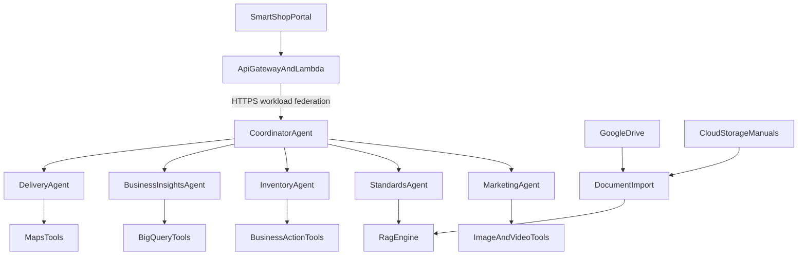

# UC-5 — ADK agents on Agent Runtime

**Status:** deployed as six Agent Engines in `us-central1`. The coordinator (`5576634465393836032`) calls delivery, insights, inventory, standards, and marketing over A2A. Python source is in `agents/uc5`. The console playground does not show the Python.  
**Actors:** Operations and Marketing (Cognito group `admin`)  
**Goal:** One admin question is answered by a coordinator on Google ADK Agent Runtime. The coordinator delegates to specialist agents and returns one combined reply.

No new login group. The shopping assistant cannot call this runtime. This document does not deploy agents and does not replace the handlers for UC-1 through UC-4.

## Architecture

The browser stops at the existing CloudFront SPA. API Gateway and the API Lambda authenticate the operator and forward the question. The Lambda calls the coordinator over HTTPS. Workload identity federation from the Lambda role is the Google credential for this path. The long-lived `smartshop/bq-reader` key is not used here, and no Google credential is sent to the browser.

The coordinator has no Maps, BigQuery, document, image, or video tool of its own. It chooses specialists, calls them, and merges the reply.

The browser does not call Agent Runtime, Maps, BigQuery, the RAG engine, Gemini, or Veo.

## Agents

| Agent | Question it owns | Tool it may call |
| --- | --- | --- |
| Coordinator | The whole turn. Delegates and combines. | None of the shared tools. |
| Delivery | Delays and routing. | Google Maps tools only (Routes and Places). |
| Business insights | Trends and performance. | BigQuery query tools only. Read-only governed views. No DDL and no row deletes. |
| Inventory | Stock and replenishment. | Business-action tools only. An order, stock, or dispatch change requires an approval check first. |
| Standards | SOPs and compliance. | RAG engine only. Every answer cites the approved document it used. An empty retrieval does not become a policy. |
| Marketing | Social-campaign stills and short videos. | Image and video tools only. |

Orders, stock, and dispatch remain in the existing AWS order and product APIs. The inventory agent does not write DynamoDB itself.

The marketing agent takes the operator’s campaign guidance and one or more catalogue products. It returns a still, a short video, or both, prepared for a social campaign. Assets are held for review. They are not written onto products and are not posted to a social network.

## Shared tools

**Google Maps tools.** Routes and Places. This is the same product surface as UC-2. The delivery agent calls it. The planning Lambda keeps its own direct calls until a later build replaces that handler.

**BigQuery query tools.** Read-only governed views on the existing `routes` and `marketing` datasets in project `project-fd286af4-b340-4967-86b`. The agent does not receive a dataset `WRITER` grant.

**Business action tools.** Call SmartShop admin APIs only after a permission and approval check. The tool receives the operator identity from the Lambda. It cannot choose a different user.

**RAG engine.** Answers only from the imported corpus. Citations are part of the tool result.

**Image and video tools.** Only the marketing agent calls these.

- Stills use `gemini-3.1-flash-image` on the global Vertex endpoint, method `:generateContent`.
- Video uses `veo-3.1-generate-001` in `us-central1`, method `:predictLongRunning`. The clip finishes asynchronously.
- The prompt is the product name, the description, and the campaign guidance.
- Guidance that names no catalogue product returns the active product names and does not generate.
- Finished bytes are stored in `gs://smartshop-marketing`. A row is written to `marketing.assets` with `status = REVIEW`. Video may be `GENERATING` until the file exists.

The deployed Marketing page still calls Gemini and Veo directly from the Lambda. Those handlers stay until a later build moves campaign requests onto this agent.

## Document import

Import is a separate pipeline. It is not a chat turn.

Google Drive is the source for standards and guidelines. Cloud Storage is the source for manuals and supporting files. A refresh job replaces the corpus the standards agent reads. A chat message does not upload a document and does not publish anything to the storefront or to a social network. If a refresh fails, the previous corpus stays in place.

## API Gateway

No new API, authorizer, or route. Admin calls stay on the existing JWT `/{proxy+}`. The Lambda checks the Cognito `admin` group the same way `/v1/admin/reports` does.

| Method and path | Role |
| --- | --- |
| `POST /v1/admin/agent/sessions` | Body `kind = operations` starts a coordinator session for this admin. `planning` and `marketing` stay the current UC-2, UC-3, and UC-4 handlers. |
| `POST /v1/admin/agent/sessions/{sessionId}/messages` | Forwards the operator text to the coordinator. The reply may include a combined answer, citations, and optional `assetId` values from the marketing agent. |
| `GET /v1/admin/agent/sessions/{sessionId}` | Reloads the session. A video still in progress is polled here until `REVIEW` or the 15 minute limit. |
| `GET /v1/admin/marketing/assets/{assetId}` | Existing admin stream of a review still or video. The browser does not receive a Vertex token. |

Express confirm (`POST /v1/orders`) does not call the coordinator.

## Data

No new DynamoDB table. Orders and products stay the system of record for inventory actions.

No new BigQuery table. Insights read governed views over tables that already exist. The marketing agent reads catalogue fields from `marketing.catalogue_products`, which is already synced from DynamoDB products.

Campaign review rows use the existing `marketing.assets` table.

| Column | Campaign value |
| --- | --- |
| `kind` | `IMAGE` or `VIDEO` |
| `status` | `REVIEW` for a finished still. `GENERATING`, then `REVIEW` or `FAILED`, for video. |
| `product_ids` | Catalogue ids named in the guidance |
| `guidance` | Operator text |
| `gcs_uri` | Object in `gs://smartshop-marketing`. Empty while video `status` is `GENERATING`. |

RAG files live in the Cloud Storage manuals bucket and in Google Drive. The portal does not store that corpus.

## Failure

| Condition | Result |
| --- | --- |
| Caller is not `admin` | 403. No agent call. |
| Coordinator or a specialist fails | The chat returns the failure. No partial stock change and no partial campaign asset. |
| Inventory action has no approval | The tool refuses. No AWS write. |
| Standards retrieval is empty | The agent says the document is not in the corpus. No unsourced policy. |
| Import fails | The previous corpus stays. The chat does not run the import. |
| Campaign guidance names no catalogue product | The marketing agent lists active names. No Gemini or Veo call. |
| Image or video generation fails | The chat says so. No `marketing.assets` review row. |
| Video is still running when the turn returns | `status = GENERATING`. The portal polls until `REVIEW` or 15 minutes, matching UC-4. |

## Out of scope

- Deploying ADK, creating the runtime, granting IAM, or connecting Google Drive.
- Replacing the deployed UC-1, UC-2, UC-3, or UC-4 handlers in this cut.
- Posting or scheduling a campaign on Instagram, Facebook, TikTok, or any other network.
- Population, storefront publishing, and the shopping assistant.
